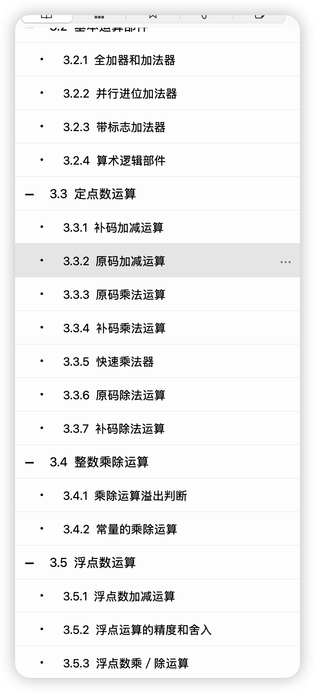

> 公开脱敏阅读版。学习内容保留；路径、私人链接及无关生活安排可能被替换。不能据此宣称与私有原档逐字相同。

# C02｜数据运算章节是否都要看

科目：计算机组成原理。以下是历史记录，不是本次重新确认的标准答案。日期按北京时间。工具输出、思考块不作为答疑正文。历史链接可能只在原资料库有效，不表示已附上被链接的教材。

## 2026-09-05 16:47｜会话 03f317ca-965d-43b8-8849-622d4906ccef｜L1361

原档：保存在本地私有恢复包，按会话ID与行号回查。

消息 UUID：`ec0d9ca0-9941-4ffe-8382-f64f78b005d5`

完全一致的问答副本：2a3a7e25-57bf-43da-9e71-8ca765e424d4 L1361；ad5055c3-9732-46b9-91eb-56f9881ff358 L1361。

### 用户原文

这几个都要看吗

### Claude 历史回答｜L1367｜2026-09-05 16:49

这几节权重差别很大，有几节可以直接扫过去。先确认一下大纲口径，这决定乘除法要不要练手算。

### Claude 历史回答｜L1378｜2026-09-05 16:51

大纲原文确认了，答案很清楚：**这 13 节里只有 6 节是重点，4 节可以扫过去，1 节可以直接跳。**

大纲对这块的表述是：乘/除运算只要求「**乘/除法运算的基本原理，乘法电路和除法电路的基本结构**」；浮点数只要求「**浮点数的加/减运算**」。这两句话直接决定了下面的取舍。

## 逐节判定

| 节 | 判定 | 说明 |
|---|---|---|
| 3.2.1 全加器和加法器 | **要看** | 基础，后面全建在这上面 |
| 3.2.2 并行进位加法器 | **要看**（懂原理即可） | 大纲点名"加法器"。理解先行进位怎么来的，不用推电路 |
| 3.2.3 带标志加法器 | **重点** | OF / SF / ZF / CF 的生成与判断，选择题高频，大纲"标志位的生成"专门列了一条 |
| 3.2.4 算术逻辑部件 ALU | **要看** | 大纲点名 |
| 3.3.1 补码加减运算 | **核心** | 必考，溢出判断三种方法要熟 |
| 3.3.2 原码加减运算 | **快过** | 现代机器不用原码做加减，考得极少。知道为什么不用就行 |
| 3.3.3 原码乘法运算 | **懂原理，不练手算** | 大纲只要"基本原理" |
| 3.3.4 补码乘法运算 | **懂原理，不练手算** | Booth 算法知道思路即可 |
| 3.3.5 快速乘法器 | **可跳** | 阵列乘法器扫一眼结构图就行 |
| 3.3.6 原码除法运算 | **懂原理** | 恢复余数 / 加减交替，知道区别 |
| 3.3.7 补码除法运算 | **懂原理** | 同上 |
| 3.4.1 乘除运算溢出判断 | **要看** | 和 C 语言的整数溢出结合考 |
| 3.4.2 常量的乘除运算 | **要看** | 移位替代乘除，选择题常见 |
| 3.5.1 浮点数加减运算 | **核心** | 对阶、尾数运算、规格化、舍入、溢出判断，大题会考 |
| 3.5.2 浮点运算的精度和舍入 | **要看** | IEEE754 四种舍入方式 |
| 3.5.3 浮点数乘/除运算 | **可跳** | 大纲明确只要求加/减 |

## 一句话版本

**认真啃四块**：带标志加法器的标志位、补码加减与溢出、常量乘除的移位实现、浮点数加减全流程。

**只懂原理不练手算**：原码/补码的乘法和除法（3.3.3 到 3.3.7 这五节）。知道"补码乘法为什么要 Booth""加减交替法比恢复余数法省在哪"，能看懂题目给的运算过程，就够了。别去背手算流程，那是老大纲的要求。

**直接跳**：3.3.5 快速乘法器、3.5.3 浮点乘除。

## 顺便问一句

你的规划里组原是**已完成**状态，现在翻这一章是在做整合复盘吗？

如果是复盘，那这十几节不该逐节重读，只要按上面的四块重点自测：随手写个补码加法判溢出、给个 IEEE754 的数做加减、算一道移位替代乘法。做得出来就过，卡住了再回去看对应那一节。整章重读要花两三天，自测只要两小时。

如果是发现之前这章学漏了，那就按上面的表补，重点四块给一天半，其余半天扫完。
