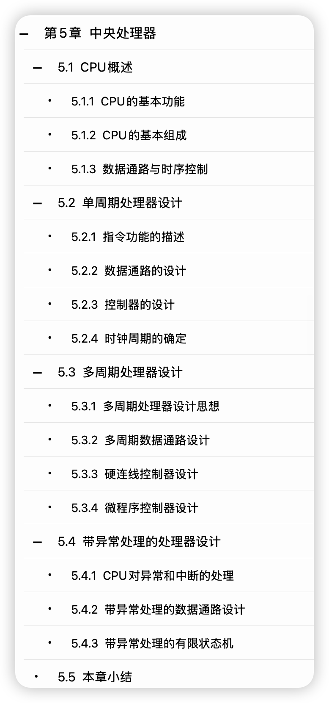
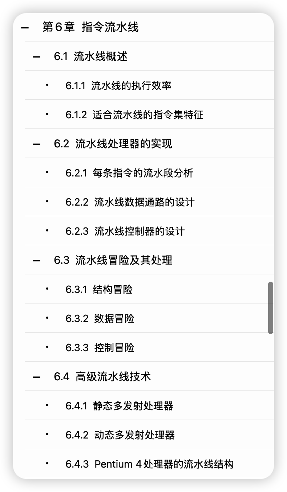

> 公开脱敏阅读版。学习内容保留；路径、私人链接及无关生活安排可能被替换。不能据此宣称与私有原档逐字相同。

# C03｜CPU要不要看袁书

科目：计算机组成原理。以下是历史记录，不是本次重新确认的标准答案。日期按北京时间。工具输出、思考块不作为答疑正文。历史链接可能只在原资料库有效，不表示已附上被链接的教材。

## 2026-09-05 16:57｜会话 03f317ca-965d-43b8-8849-622d4906ccef｜L1391

原档：保存在本地私有恢复包，按会话ID与行号回查。

消息 UUID：`e9287735-457c-4063-8fac-85ed0a99baa9`

完全一致的问答副本：2a3a7e25-57bf-43da-9e71-8ca765e424d4 L1391；ad5055c3-9732-46b9-91eb-56f9881ff358 L1410。

### 用户原文

cpu要看他的吗

### Claude 历史回答｜L1396｜2026-09-05 16:59

这块我的答案和第 3 章不一样：**不建议整章换袁书，只挑三节看。**

## 为什么第 3 章可以换，CPU 不行

第 3 章讲的是底层原理，补码的模运算本质、标志位怎么从电路生成，这些是通用的，谁讲得透就跟谁学。

CPU 不一样。**408 有自己一套"模型机"传统**——真题大题的固定形式是：给你一张自定义的数据通路图，让你分析指令的执行过程、写出微操作序列、数时钟周期。王道整本书就是照着这个出题方式组织的。

袁春风是 MIPS 体系（Patterson 路线），讲的是"如何从零设计一个处理器"。这套更系统、更真实，但**和 408 的考法隔了一层**。你按她的书学完单周期、多周期的 MIPS 设计，回头看真题那张模型机图，还得再做一次翻译。

而且大纲里明确要考的**多处理器基本概念**（SISD/SIMD/MIMD、硬件多线程、多核、共享内存多处理器），袁书这两章里没有，得回王道。

## 值得看袁书的三节

| 节 | 理由 |
|---|---|
| **5.1.3 数据通路与时序控制** | 如果你对"数据通路"到底是什么还没有画面感，她讲得比王道具体。这是后面所有大题的地基 |
| **6.3 流水线冒险**（结构 / 数据 / 控制） | **最值得看的一块。** 数据冒险的转发和阻塞、控制冒险的分支预测，袁书讲得比王道细一个档次，而 408 近几年流水线越考越重 |
| **5.4 异常和中断的处理** | 大纲有"异常和中断机制"专门一条。袁书从处理器设计角度讲，王道从 I/O 角度讲，两边互补 |

大概一天，不要更多。

## 必须回王道的

**5.3.3 硬连线控制器、5.3.4 微程序控制器** —— 这两节别用袁书。408 考微程序的方式很固定：微指令格式（水平型/垂直型）、微地址形成方式、微程序时序、控制存储器容量计算。这套考法是王道体系的，袁书的讲法对不上，看了反而要重新对齐。

**5.2 单周期设计、5.3.2 多周期数据通路** —— 袁书是完整的 MIPS 实现，408 不要求你设计处理器，只要求读懂给定的图。用王道的模型机更对口。

## 直接跳

**6.4.3 Pentium 4 处理器的流水线结构** —— 明确超纲。

**6.4.1 静态多发射、6.4.2 动态多发射** —— 大纲只要"超标量和动态流水线的**基本概念**"，知道超标量是什么、动态调度解决什么问题就够，袁书这两节的深度用不上。

## 一句更重要的话

**CPU 大题的能力，看书是练不出来的。**

它只能靠一样东西练：拿 408 真题里那些数据通路图，自己在图上追踪一条指令走完，写出每个时钟周期的微操作。09 年到 24 年真题里 CPU 大题有十来道，这十来道做透，比读任何一本书都管用。

所以时间这么分：**袁书三节一天 → 王道把微程序和多处理器补齐半天 → 剩下全部砸在真题大题上。**

## 提醒一句进度

你第 3 章我建议了两三天，CPU 再一天半，408 这边就用掉四五天。计网 9/12 收口这个节点还能守住，但**如果 CPU 也变成整章重读，408 就会挤掉数学的时间**——而你现在真正的短板是数学。

408 从 57 分起步，补到 80 靠的是把地基（第 3 章）和高频大题（CPU、流水线）打通，不是把每本书都读一遍。这两块补完就转真题。
