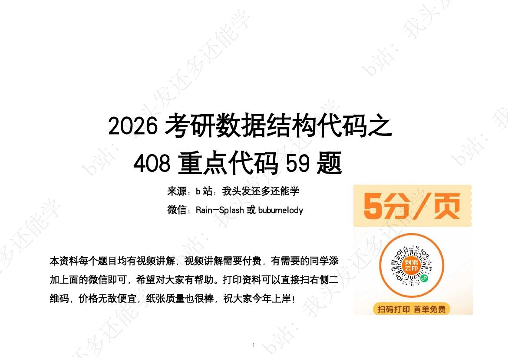
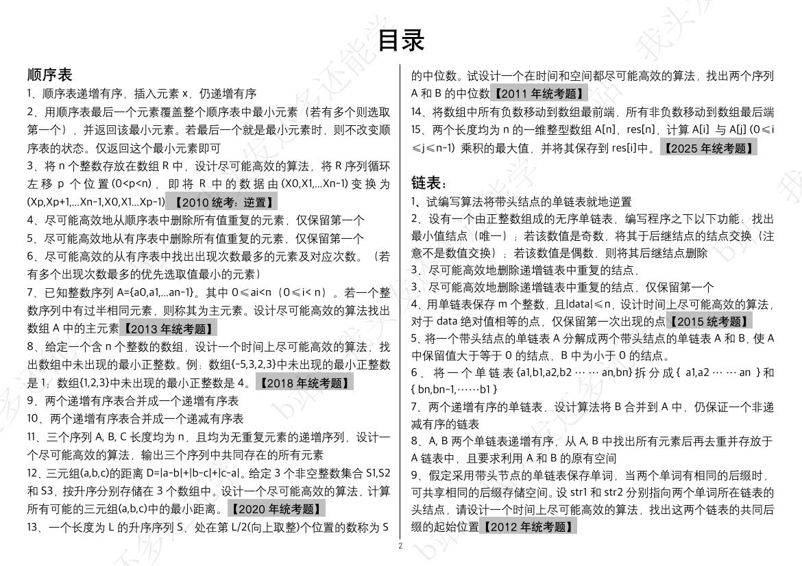
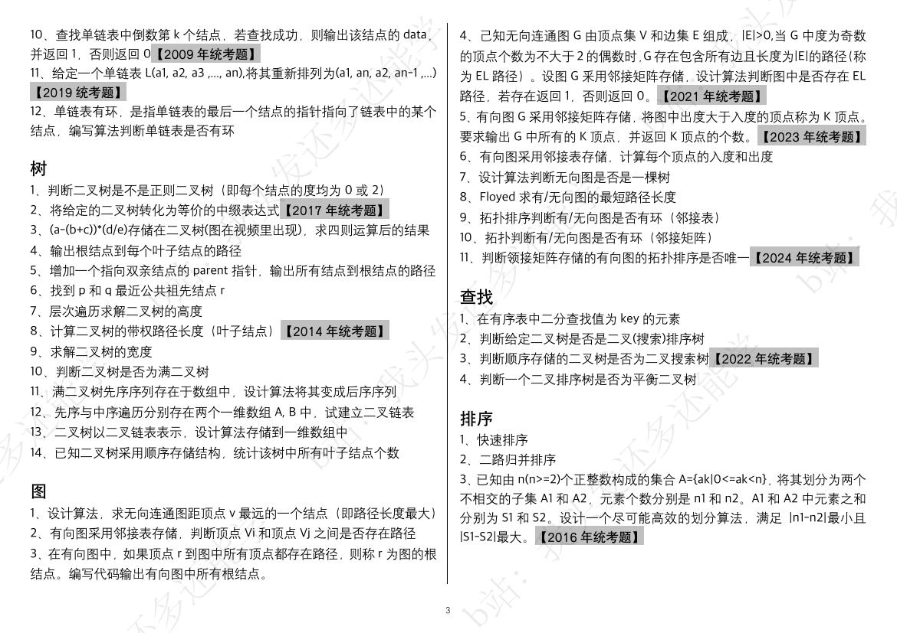
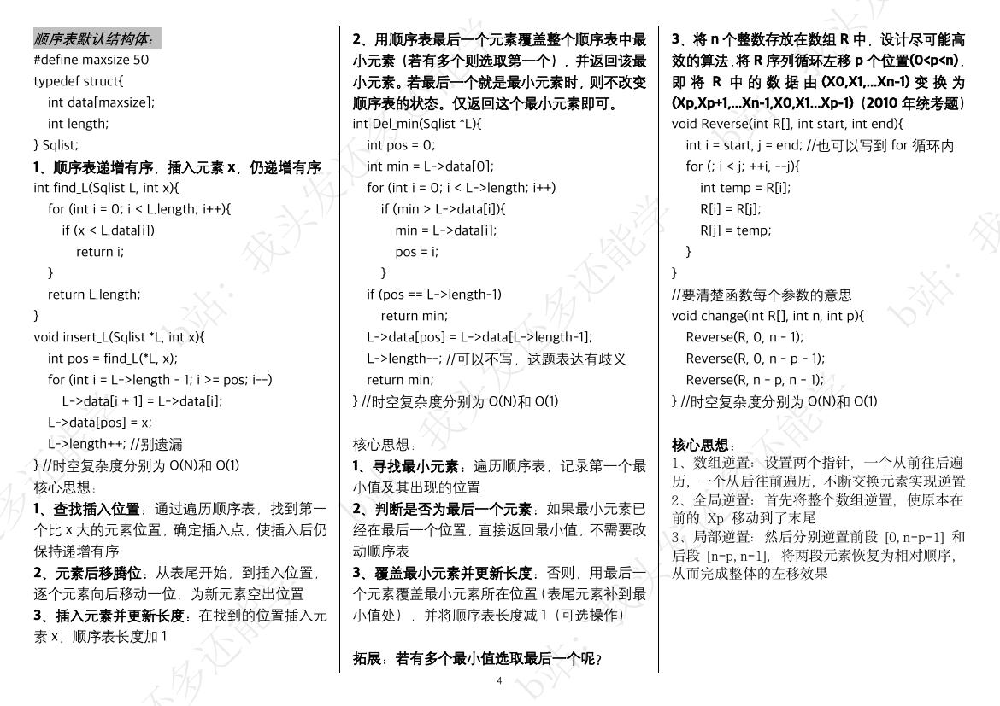
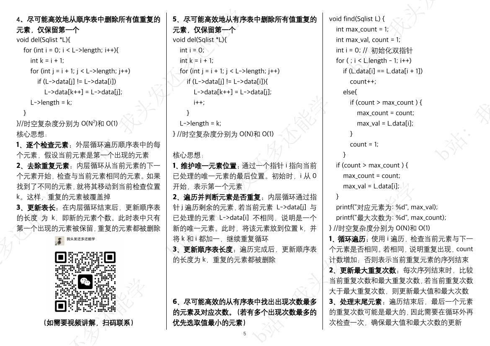
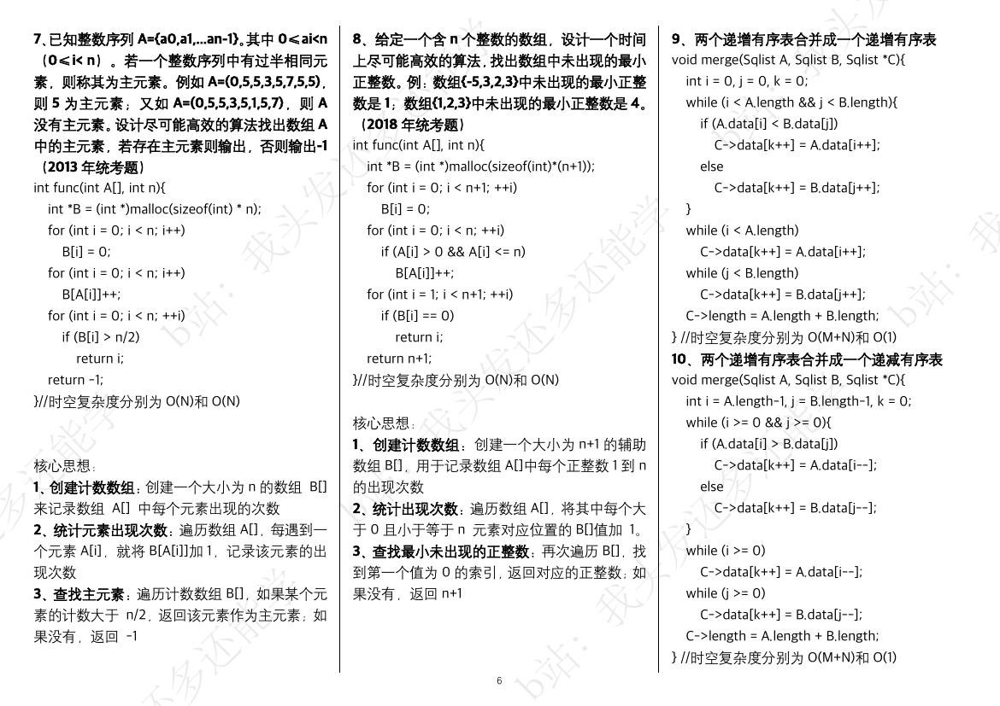

> 公开脱敏阅读版。学习内容保留；路径、私人链接及无关生活安排可能被替换。不能据此宣称与私有原档逐字相同。

# D01｜代码59题能否覆盖算法题；用户限定范围

科目：数据结构。以下是历史记录，不是本次重新确认的标准答案。日期按北京时间。工具输出、思考块不作为答疑正文。历史链接可能只在原资料库有效，不表示已附上被链接的教材。

## 2026-08-21 21:25｜会话 2b6fabf5-3f77-4fad-8ba5-f6c0b7b3aed2｜L1867

原档：保存在本地私有恢复包，按会话ID与行号回查。

消息 UUID：`44d1ba44-ae57-4169-b085-bd8c22cdfd56`

### 用户原文

（本条仅发送图片，没有文字。）














### Claude 历史回答｜L1874｜2026-08-21 21:26

读完了,结构清楚了。直接回答你:

## 不能。会这59题,你锁死的是408里的**一道题**,不是408

这份 PDF 全是**数据结构的算法设计题(代码题)**——顺序表15 / 链表12 / 树14 / 图11 / 查找4 / 排序3,全是"设计算法+手写C代码"那种。它在 408 里占多大:

```
408 = 选择题 40×2 = 80分  +  综合大题 7道 = 70分
        综合大题里:数据结构 ≈ 23分(2道)
                     └ 代码题只是其中 1 道,约 13 分
        组原 / OS / 网络 各占其余
```

**代码题 ≈ 13分 / 150分,大概 8-9%。** 会这59题 = 你把这**一道、还是最多人怕的一道**,从"可能丢13分"变成"稳拿"。是好事,但是一块,不是全部。

**它完全没碰的:**
- 数据结构选择题(复杂度、树/图性质、排序稳定性、哈希……)
- 数据结构**另一道**大题(手工画图/模拟/计算,不写代码那种)
- **组原45 + OS35 + 网络25 = 105分,一个字没沾**——这105分才是408的大头

## 一个坑:"必背"这两个字会害你

你说的是"**理解**并且会写"——这个措辞救了你,关键就在"理解"。

**408代码题每年给新场景,你死背这59段,一变形就崩;你吃透每题上面那个"核心思想"(双指针、计数辅助数组、遍历+记录、前后逆置那些套路),才迁移得到没见过的题。** 这资料每题都配了核心思想——**背的是思想,不是代码。**

## 怎么算"真的会"——就一条标准

**遮住答案,只看题目,在白纸上手写出来。** 考试是手写,没IDE、不能编译、不能回看。

"看着代码看懂了"根本不算会。**做完一题,盖上,拿张纸默一遍;默不出来的,那才是你真正的错题**,拿去二刷。这个筛出来的清单,比"我做完59题了"值钱得多。

---

定位:这59题**值得做、也选得好**(全是历年真题+高频),对你"稳上330"是该抓的确定分,把它默到能默出来,那13分基本到手。但**做完它,408才走了一小步**。

所以我还是上一条那个问题:**你数据结构整体走到哪了?** 选择题的概念、组原/OS/网络那105分——那才是决定你上不上得了330的大头。代码题是最好啃的骨头,别啃完这块就以为408稳了。


## 2026-08-21 21:27｜会话 2b6fabf5-3f77-4fad-8ba5-f6c0b7b3aed2｜L1880

原档：保存在本地私有恢复包，按会话ID与行号回查。

消息 UUID：`ae331414-286d-4612-8994-4d298cb1f013`

### 用户原文

只是说算法题


### Claude 历史回答｜L1885｜2026-08-21 21:28

明白,只说算法题。答案是:**基本够,但"没问题"要打个折——而且折在哪你得清楚。**

**先给你定心丸:这59题选得很全。** 历年真题 + 六大类(顺序表/链表/树/图/查找/排序)的高频套路都覆盖了。作为"算法题套路库",这份清单很完整。你把它真吃透,考场那道算法题**你不会空、不会慌**——这点是稳的。

**但打折的原因只有一个:算法题考的是设计没见过的新题,不是默写见过的。** 每年那道都是新场景。你把59段代码背下来,考场给个变形(改个条件、换个结构、两个套路拼一起),照着背就可能卡。

**所以真正的"稳",靠两件事:**

1. **认套路,不背代码。** 每题上面那个"核心思想"——双指针、计数辅助数组、遍历+记录、前后逆置——**你要能一眼看出"这题该用哪个套路",而不是回忆"这题代码长啥样"。** 认得出套路,新题也拆得开。

2. **吃部分分。** 408算法题给部分分:**思路对给分、关键代码对给分**,不用全对。所以哪怕真遇到没见过的,套路内化了,写出思路+能写多少写多少,**10分上下保底**。这对你"稳上330"完全够——你要的不是13/13,是"这道稳拿9-11、绝不空着"。

**检验就一句:遮住答案,白纸手写,再把题目条件改一改看你还会不会。** 过了这关,算法题对你才真叫"基本没问题"。

最后提一个容易漏的缝:**别只会这59道的"标准长相"。** 随手建链表、遍历、基本增删查这些**基本功要能盲写**——新题经常就是把这些积木重新拼。59道之外,底层也得熟。
