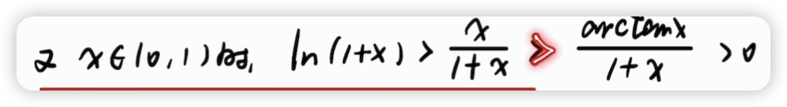

> 公开脱敏阅读版。学习内容保留；路径、私人链接及无关生活安排可能被替换。不能据此宣称与私有原档逐字相同。

# M04｜arctan不等式的红色步骤

科目：高数。以下是历史记录，不是本次重新确认的标准答案。日期按北京时间。工具输出、思考块不作为答疑正文。历史链接可能只在原资料库有效，不表示已附上被链接的教材。

## 2026-09-03 08:31｜会话 31e93cbb-d992-4a67-81ea-4005281766cd｜L6187

原档：保存在本地私有恢复包，按会话ID与行号回查。

消息 UUID：`4362d2c6-f218-435d-a084-8ff2b102614b`

### 用户原文

（本条仅发送图片，没有文字。）

### Claude 历史回答｜L6197｜2026-09-03 08:31

红色那个 `>` 问的是 **x/(1+x) > arctan x/(1+x)**。分母 1+x 在 (0,1) 上是正的，两边同乘直接约掉，题目就变成一句话：

**x ∈ (0,1) 时，x > arctan x。**

## 证明

令 f(x) = x − arctan x。

- f(0) = 0 − 0 = 0
- f′(x) = 1 − 1/(1+x²) = x²/(1+x²)，x > 0 时恒 > 0

所以 f 在 [0,1) 上单调递增，f(x) > f(0) = 0，即 x > arctan x。两边除以正数 1+x，就得到红色那步。

## 整条链其实是同一套路

三个不等号都是"**作差 → 求导 → 看端点**"：

| 不等式 | 作差 | 导数 | 端点 |
|---|---|---|---|
| ln(1+x) > x/(1+x) | g = ln(1+x) − x/(1+x) | g′ = 1/(1+x) − 1/(1+x)² = **x/(1+x)²** > 0 | g(0)=0 |
| x > arctan x | f = x − arctan x | f′ = **x²/(1+x²)** > 0 | f(0)=0 |
| arctan x > 0 | — | arctan 在 x>0 时为正 | — |

## 易错点

导数在 x=0 处等于 0，别慌——**端点导数为零不影响单调性**，只要在开区间 (0,1) 内导数恒正即可，f(0)=0 是等号成立的那一点，x>0 后严格大于。

另一个坑是把 arctan x 的导数记成 1/(1+x)，那是 ln(1+x) 的导数。arctan x 的导数是 **1/(1+x²)**，分母带平方。

## 记法

这两个是数二里最常用的一组"夹逼"不等式，x>0 时：

**arctan x < x，ln(1+x) < x，sin x < x** —— 三个都是"曲线在 x=0 处与 y=x 相切，之后跑到 y=x 下方"。
