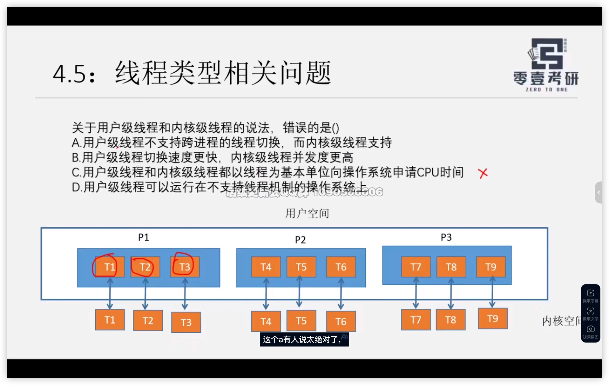

> 公开脱敏阅读版。学习内容保留；路径、私人链接及无关生活安排可能被替换。不能据此宣称与私有原档逐字相同。

# O04｜用户级线程与内核级线程选择题

科目：操作系统。以下是历史记录，不是本次重新确认的标准答案。日期按北京时间。工具输出、思考块不作为答疑正文。历史链接可能只在原资料库有效，不表示已附上被链接的教材。

## 2026-09-09 16:59｜会话 0a3f8cc2-0665-499c-a41c-b4d5ab00631a｜L462

原档：保存在本地私有恢复包，按会话ID与行号回查。

消息 UUID：`9e936643-5a02-43d6-9998-8ce507142621`

完全一致的问答副本：1689ce79-9c89-4c4f-982a-30e61540d578 L632；fd34bb1a-5fb5-4a51-b8dd-ac228881e3f9 L458。

### 用户原文

讲讲这个题

### Claude 历史回答｜L467｜2026-09-09 17:01

答案是 **C**。但这道题真正的价值不在选出 C，在于**四个选项其实是同一个问题的四种问法**。

## 一句话抓住整个考点

**内核认不认识线程。**

就这一句。用户级线程和内核级线程的全部区别，都是从这一条推出来的：

- **用户级线程（ULT）**：线程由**用户空间的线程库**管理，内核**根本不知道有线程**，内核眼里只有进程
- **内核级线程（KLT）**：内核**认识每一个线程**，线程是内核的调度对象

把这一条握住，四个选项不用记，现推就行。

## 一张表推出全部结论

| 问题 | 内核不认识线程（ULT） | 内核认识线程（KLT） |
|---|---|---|
| **谁向 OS 申请 CPU 时间** | **进程** | **线程** |
| 切换要不要陷入内核 | 不要，纯用户态改寄存器和栈 → **快** | 要，模式切换 → 慢 |
| 一个线程阻塞会怎样 | **整个进程都阻塞** | 只阻塞它自己 |
| 能不能用多核 | 不能，进程只占一个核 | 能 → **并发度高** |
| 能不能跨进程切线程 | **不能** | 能 |
| 需要 OS 支持线程吗 | **不需要** | 需要 |

这张表就是这个考点的全部内容。现在逐项对：

**A. 用户级线程不支持跨进程的线程切换，而内核级线程支持** → 表第 5 行，**对**

**B. 用户级线程切换更快，内核级线程并发度更高** → 表第 2 行 + 第 4 行，**对**

**C. 都以线程为基本单位向操作系统申请 CPU 时间** → 表第 1 行，ULT 是**进程**为单位，**错**

**D. 用户级线程可以运行在不支持线程机制的操作系统上** → 表第 6 行，**对**

## C 错得有多彻底

C 不只是"说得不准"，是方向性错误。

**用户级线程压根没有资格"向操作系统申请 CPU 时间"**——它连和操作系统对话的通道都没有。真实流程是：

1. **进程**向 OS 申请，OS 分给进程一个时间片
2. 进程拿到时间片后，**用户态的线程库**在进程内部决定这段时间给哪个线程

内核从头到尾不知道 T1、T2、T3 的存在。这也是为什么"一个线程阻塞会拖死整个进程"——内核看到的是进程发了个阻塞式系统调用，它就把**进程**挂起了，它不知道里面还有别的线程能跑。

## 关于"A 是不是太绝对"

字幕里有人质疑 A。这个质疑值得回应，因为它的答案能让你更牢地记住这个概念。

**A 不是绝对，是定义决定的，绕不过去。**

"用户级线程切换"的定义就是：在用户态完成、不陷入内核、只保存恢复寄存器和栈指针。

而跨进程意味着**换地址空间**，换地址空间必须改页表基址寄存器 PTR —— 这是**特权指令，必须在内核态执行**。

所以：

> 一旦跨了进程，就必然陷入内核。而一旦陷入内核，那就是**进程切换**，不是"用户级线程切换"了。

**A 是同义反复，不可能不成立。** 不是老师说话绝对，是这两个概念在定义上就互斥。

**一个需要注意的边界**：如果是**多对多（M:N）混合模型**，用户级线程映射到多个内核级线程上，看起来能跨核甚至跨"内核实体"。但那已经是混合模型，不是纯用户级线程。408 里单说"用户级线程"，默认指纯 ULT。

**这种"纯模型 vs 混合模型"的边界，正是 408 选择题最爱设陷阱的地方。** 遇到线程题先问自己：这题说的是纯 ULT、纯 KLT，还是混合？

## 顺手连一下你在看的讲义

你昨天那份《进程进阶》，场景 4.2 第 2 问就是这条的下一层：

> T1、T2 属于进程 P1，T3、T4 属于进程 P2。T1 和 T2 都执行 `*((int*)10086) += 1;`

考的是：**同进程的线程共享地址空间**。T1 和 T2 里的 10086 指向同一块物理内存，会打架（竞态）；而 P2 里的 10086 是另一个地址空间里的 10086，物理上完全不同。

这题和你现在这道是一体两面：**线程共享什么、不共享什么** —— 共享地址空间、全局变量、打开文件表；私有的是寄存器、程序计数器、栈。

## 白纸输出检验点

合上一切，拿张纸，只写标题"用户级线程 vs 内核级线程"，然后默写上面那张六行表。

**能把六行都写出来，这个考点就过了。写不出来的那几行，就是你的红笔。**
