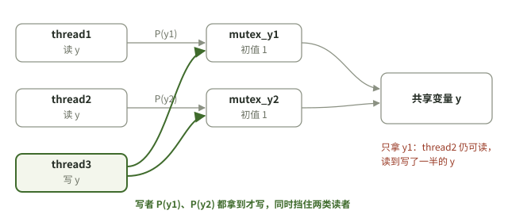

# 2026-10-05 操作系统｜把锁设在共享对象上

## 今天实际涉及

- 补充第2章与内核态框架，讨论系统调用、调度检查时机、页表和信号；请求了流程图。记录称图已补，但本仓库没有这些新图文件。
- 上传PV第22题作答，旧助手指出写者需要同时获取y1、y2两把锁。
- 上传第23、24题作答，旧助手评价主体正确，并修正数组长度与取模下标写法。没有原手写图，本次不等于重新判卷。
- 第25、27、08题和04～07(2)回炉题只是安排，没有当天完成证据。

## 题目状态

编号按王道2026第2.3节PV综合题题号，一题一个编号；题源年份照抄当天记录，未另行核对真题。状态由下方「作答记录」推出：三道有作答的题都没有注明是否独立完成，原手写图也不在本仓库，只有旧助手的判断，所以停在“作答待核实”。

| 题目 | 状态 | 来源 | 卡点／错误步骤 → 更正 | 下次验证 |
|---|---|---|---|---|
| `PV-22` 三线程复数相加（记录称2017统考） | 作答待核实 | [14:51](../../问答记录/操作系统/2026-10-05.md) | thread3写y用了未定义的`P(mutex_y)` → 先后获取`mutex_y1`、`mutex_y2`再写，写完两把都释放（写者要同时排除两类读者） | 闭卷重写thread3写y片段，逐把说明保护对象 |
| `PV-23` 哲学家＋碗（记录称2019统考） | 作答待核实 | [15:13](../../问答记录/操作系统/2026-10-05.md) | 数组未写长度 → `semaphore kuai[n]`；`kuai[i+1]%n`取模在下标外 → `kuai[(i+1)%n]`；未写信号量含义会扣分 | 闭卷重写，写出`wan`初值理由和每个信号量含义 |
| `PV-24` 前驱关系（记录称2020统考） | 作答待核实 | [15:13](../../问答记录/操作系统/2026-10-05.md) | 记录中没有指出错误；尚不能确认是否覆盖原图全部边 | 补原题图后逐条边核对P、V位置 |
| `PV-25` 开关中断实现互斥（记录称2021统考） | 仅安排 | [14:54](../../问答记录/操作系统/2026-10-05.md)、[14:58](../../问答记录/操作系统/2026-10-05.md) | 只有旧助手对题型的概括，没有你的判断 | 先盖住答案，判断关中断后能否忙等，再对解析 |
| `PV-27` swap实现临界区（记录称2023统考） | 仅安排 | [14:54](../../问答记录/操作系统/2026-10-05.md)、[14:58](../../问答记录/操作系统/2026-10-05.md) | 只有旧助手对题型的概括，没有你的判断 | 先盖住答案，判断退出区和swap原子性，再对解析 |
| `PV-08` 纯软件两线程互斥 | 仅安排 | [14:54](../../问答记录/操作系统/2026-10-05.md)、[14:58](../../问答记录/操作系统/2026-10-05.md) | 只有旧助手对题型的概括，没有你的判断 | 先盖住答案，判断是否满足忙则等待、空闲让进 |
| `PV-04` 回炉 | 仅安排 | [14:54](../../问答记录/操作系统/2026-10-05.md) | 当天没有重做证据 | 闭卷重做，写下卡住的那一步 |
| `PV-05` 回炉 | 仅安排 | [14:54](../../问答记录/操作系统/2026-10-05.md) | 当天没有重做证据 | 闭卷重做，写下卡住的那一步 |
| `PV-06` 回炉 | 仅安排 | [14:54](../../问答记录/操作系统/2026-10-05.md) | 当天没有重做证据 | 闭卷重做，写下卡住的那一步 |
| `PV-07(2)` 回炉，第(2)问 | 仅安排 | [14:54](../../问答记录/操作系统/2026-10-05.md) | 当天没有重做证据 | 闭卷重做，写下卡住的那一步 |
| `二模-27` 时钟中断作用 | 已讨论 | [11:26](../../问答记录/操作系统/2026-10-05.md) | 没有你的作答；选A是旧助手推导，PPT未给答案 | 找到原题后先自己逐项判断，再对照 |

## 作答记录

每次作答一行。作答方式：独立／有提示／看答案后／未注明／未作答；核对结果：正确／部分正确／错误／未核对；核对依据：原件已核／仅旧助手判断／未核对。只有“独立＋正确＋原件已核”才能升到“独立做对”，且作答内容要链接仓库里的作答全文或原图；另一天再这样通过一次才是“隔日重做通过”。脚本只检查这些字段齐不齐，不判断答案对不对。

| 编号 | 作答方式 | 作答内容／附件 | 核对结果 | 核对依据 | 来源 |
|---|---|---|---|---|---|
| `PV-22` | 未注明 | 手写图未入库；thread3写y片段摘录见来源 | 部分正确 | 仅旧助手判断 | [14:51](../../问答记录/操作系统/2026-10-05.md) |
| `PV-23` | 未注明 | 手写图未入库；被改的下标与声明摘录见来源 | 部分正确 | 仅旧助手判断 | [15:13](../../问答记录/操作系统/2026-10-05.md) |
| `PV-24` | 未注明 | 手写图未入库；信号量命名摘录见来源 | 正确 | 仅旧助手判断 | [15:13](../../问答记录/操作系统/2026-10-05.md) |

## 知识点与适用条件

### 共享y：读读可并发，写者要排除所有读者

在第22题所述两把读锁设计中，thread1受y1约束，thread2受y2约束，thread3写y时必须获取两把。使用未定义的`mutex_y`不能实现该设计。判断死锁要看完整的持锁路径，不能只比较两段P操作的字面顺序。

### 哲学家＋碗：限制同时竞争筷子的人数

旧解使用`wan=min(m,n-1)`限制同时进入竞争的进程数，避免n个人各持一根筷子形成环等待。这一写法需以题目规定的筷子数量、相邻关系和就餐流程为前提，不自动保证公平或无饥饿。

数组写成`kuai[n]`并说明各信号量初值；右手筷子是`kuai[(i+1)%n]`，不是`kuai[i+1]%n`。后者把取模施加到了数组元素上。

### 前驱关系：完成方V，依赖方P

记录中的ac、bc、ce、de初值为0，C等待A与B，E等待C与D。必须结合原前驱图判断边是否已全部覆盖，不能只背变量名。

## 我的卡点与纠正

- 写y使用未定义的mutex_y → 没有把写者和两类读者都约束住 → 在原模型中获取y1、y2。
- 取模在下标外 → 没有正确表示环形邻居 → 改成`(i+1)%n`放进方括号。
- 询问“为什么只看答案” → 旧解释只是对计划原因的推测 → 可以先闭卷判断互斥性质，再对照解析，而非必须跳过思考。

## 需要保留的边界

冲刺PPT的AX、INT80、NEED_RESCHED等是特定教学／体系结构语境，不是所有操作系统的统一实现。“进内核不换页表”“缺页程序用逻辑地址改页表”均需注明模型与版本，不能泛化。二模27题选A是原助手推导，PPT没有答案，尚未独立核原题。

## 闭卷自测

### 自测：三线程复数相加｜thread3写y时，应该获取哪些锁，为什么？

**题干**：`PV-22`（2017统考题，王道第2.3节综合题22）。同一进程内有三个并发线程，全局变量`x、y、z`是复数；各线程的`w`是局部变量。复数相加分别读取、相加实部与虚部。

```c
typedef struct { float a; float b; } cnum;
cnum x, y, z;  // 全局变量
cnum add(cnum p, cnum q) {
    cnum s;
    s.a = p.a + q.a;
    s.b = p.b + q.b;
    return s;
}
// 三个线程并发执行；省略号为原题保留的后续代码
thread1 { cnum w; w = add(x, y); ... }
thread2 { cnum w; w = add(y, z); ... }
thread3 {
    cnum w;
    w.a = 1; w.b = 1;
    z = add(z, w);
    y = add(y, w);
    ...
}
```

原题要求：添加必要的信号量及P、V操作，确保互斥访问临界资源，同时最大限度地并发执行。

本次只复习你上次出错的`y`片段：既定设计中，thread1读`y`使用`mutex_y1`，thread2读`y`使用`mutex_y2`，二者初值均为1。请写出thread3在`y = add(y, w)`前后的P、V操作，并解释为什么只拿一把不够。此处不要求凭记忆回忆题号。

题源：本次补充检索王道2027《操作系统》第2.3节第22题（2017统考）；代码按原题结构重排，不是你的作答。2026版题号与文字记录对应；完整代码的原页核对情况见文末。

**参考要点**：两类读者分别受y1、y2保护。写者要同时排除两类读者；单拿一把会漏掉另一类。锁名可以不同，语义必须覆盖全部冲突。



### 自测：wan限制为min(m,n-1)主要阻止哪种情况？

**题干**：`PV-23`（2019统考题）。有$n\geq3$名哲学家围坐圆桌，桌中心有$m\geq1$个碗，相邻两人间各有一根筷子。每人拿到一个碗及左右两根筷子才能就餐，用完归还；要求尽可能多的人同时就餐，且不发生死锁。

本次复习的方案：先`P(wan)`，再依次拿左、右筷子；就餐后还筷子并`V(wan)`。`wan`初值取`min(m,n-1)`。请说明`m`和`n-1`分别限制什么，以及它阻止哪种死锁局面。题干据王道2027第2.3节第23题整理；这是对既有方案的局部复习。

**参考要点**：在该题模型下限制同时竞争筷子的人数，避免n个人全部各拿一根形成环等待；不因此声称没有饥饿。

### 自测：kuai[i+1]%n和kuai[(i+1)%n]有什么不同？

**题干**：在圆桌哲学家问题中，$n\geq3$，哲学家编号为`0…n-1`。`kuai`是长度为`n`的筷子信号量数组，第`i`人左侧筷子的下标为`i`，右侧应为按圆环顺序的下一个下标。请比较两种右侧筷子写法，特别检查`i=n-1`时访问的位置。来源：`PV-23`的下标纠错，见当天15:13问答。

**参考要点**：前者对元素取模且可能越界；后者先把索引环绕到0到n-1，再访问数组。

### 自测：C依赖A、B，为什么两个同步信号量初值为0？

**题干**：`PV-24`（2020统考题）。现有操作A、B、C、D、E：C必须在A和B都完成后执行；E必须在C和D都完成后执行。原题要求用P、V操作描述同步关系并说明信号量与初值。

本卡只考C的两个前驱：为`A→C`和`B→C`分别设同步信号量`ac、bc`。为什么初值都是0，而不是1？请同时指出A、B、C中对应P、V的位置。题干据王道2027第2.3节第24题整理，不需要另猜一张前驱图。

**参考要点**：未完成前不允许C通过；A、B完成各自发V，C分别P等待两项。还应结合原图检查后继，不照搬孤立模板。

### 自测：迁移｜如果读y的线程数量不固定、随时增加，还能沿用`PV-22`“每个读者一把锁”的写法吗？

**题干**：原场景只有两个固定读者thread1、thread2和一个写者thread3，共享变量`y`；两个读者分别使用各自的锁，写者修改`y`时同时取得两把锁。现在改为读者数量不固定、可随时新增，仍要求读读可并发、读写互斥。请判断能否原样保留“预先给每个读者配一把锁、写者拿全”的方案，并说出需要改变的机制。这是基于`PV-22`条件改编的迁移题，不是另一道原真题。

**参考要点**：不能直接沿用。`PV-22`的两把锁依赖“读者恰好两类、各有固定的一把锁”。读者数量不定时，写者无法预先拿全所有锁，应改用读者-写者问题的计数写法：用一个计数器记录正在读的人数，并用互斥信号量保护计数器；第一个读者封锁写者，最后一个读者释放。这里还要说明采用读者优先还是写者优先。

## 下次先做

- [ ] 先做`PV-22`：闭卷重写thread3写y片段，说明每一把锁保护什么；不看答案独立写完，把作答全文或照片放进当天问答，再请人对照核对；这样下次复盘才能记一行“独立＋核对结果＋原件已核”。
- [ ] `PV-23`：闭卷重写，对照上表的两处下标／声明错误自查。
- [ ] 把`PV-22`～`PV-24`原手写图或完整题干补到对应记录，复核“全对”评价；补不上就保持“作答待核实”。

## 来源与边界

- [当天操作系统问答](../../问答记录/操作系统/2026-10-05.md)：11:26、12:18、14:51、14:54、14:58、15:13。
- 本复盘依据已上传文字；不是重新读取了PPT、教材、流程图或手写原图。
- 2026-10-07题面补充：检索了王道2026与2027《操作系统》的本机OCR文本。第22题代码来自2027版OCR第137页标记，第23、24题文字与2026版第136页标记交叉比对；代码中的OCR冒号已按语法改排为分号。PDF原页当前未能成功读取，版面及逐字符仍待核，不能宣称已经对照扫描页。此补充不改变任何作答状态，也不代表找回了你的手写解答。
