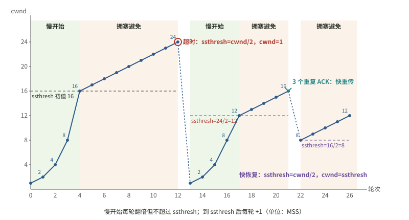

# 2026-10-08 计算机网络｜2009 真题整卷后的网络部分复盘

## 今天实际涉及

- 已作答（整卷，独立）：2009 年 408 真题。本科判错的是选择 33、34、36 和大题 47（估 2/9）。答题卡原图含姓名、未公开，作答由批改助手看原图后转述。
- 已讨论（看解析后追问，未重做）：2009-35 GBN 累积确认；2009-47 路由表里的主机路由和默认路由。
- 提示阶段（未作答）：2009-39 TCP 超时后的拥塞窗口；另按课件重绘了拥塞窗口变化图。
- 未完成：33、34、36 的原题题干、考点和错因都还没补；35 的 GBN／SR 变式题、47 的迁移题都在等闭卷作答。
- 35、39 两题在整卷中各自答对还是答错，本科问答里没有记录，待核实。
- 本复盘由每晚 22:00 的定时任务依据当天问答整理，不是用户口述的总结。

## 题目状态

| 题目 | 状态 | 来源 | 卡点／错误步骤 → 更正 | 下次验证 |
|---|---|---|---|---|
| `408-2009-33` 2009 真题选择第 33 题（题干缺失） | 作答待核实 | [16:51](../../问答记录/计算机网络/2026-10-08.md) | 整卷判错；原题与考点未补，错因待核实 | 对照真题册补题干、考点和错因 |
| `408-2009-34` 2009 真题选择第 34 题（题干缺失） | 作答待核实 | [16:51](../../问答记录/计算机网络/2026-10-08.md) | 整卷判错；原题与考点未补，错因待核实 | 对照真题册补题干、考点和错因 |
| `408-2009-36` 2009 真题选择第 36 题（题干缺失） | 作答待核实 | [16:51](../../问答记录/计算机网络/2026-10-08.md) | 整卷判错；原题与考点未补，错因待核实 | 对照真题册补题干、考点和错因 |
| `408-2009-47` 子网划分、R1 路由表与路由聚合 | 作答待核实 | [16:51](../../问答记录/计算机网络/2026-10-08.md)、[19:38](../../问答记录/计算机网络/2026-10-08.md) | 子网写成 /7 → 202.118.1.0/25、202.118.1.128/25；主机路由接口写 E0、无掩码 → 255.255.255.255、L0；互联网写 130.11.120.0、L1 → 默认路由 0.0.0.0/0、下一跳 202.118.2.2、L0（站在 R1 的角度写）；第 (3) 问空 → R2 加 202.118.1.0/24、下一跳 202.118.2.1 | 闭卷做三子网（120、60、60）迁移题并写 R1 路由表 |
| `408-2009-35` GBN 只收到 0、2、3 号确认时重发几帧 | 已讨论 | [19:12](../../问答记录/计算机网络/2026-10-08.md) | 疑问“1 号帧为什么不重传” → ACK3 累积确认了 0～3，窗口左沿滑到 4，只有 4～7 会超时重发 | 闭卷做 19:12 的 GBN／SR 变式 |
| `408-2009-39` TCP 超时后 4 个 RTT 的拥塞窗口 | 已讨论 | [19:23](../../问答记录/计算机网络/2026-10-08.md)、[19:26](../../问答记录/计算机网络/2026-10-08.md) | 尚未作答，停在提示阶段 | 独立写出超时后 ssthresh、cwnd，逐个 RTT 列 cwnd 并选答案 |

## 作答记录

| 编号 | 作答方式 | 作答内容／附件 | 核对结果 | 核对依据 | 来源 |
|---|---|---|---|---|---|
| `408-2009-33` | 独立 | 整卷答题卡原图（含姓名，未公开），所选选项未转写 | 错误 | 仅旧助手判断 | [16:51](../../问答记录/计算机网络/2026-10-08.md) |
| `408-2009-34` | 独立 | 整卷答题卡原图（含姓名，未公开），所选选项未转写 | 错误 | 仅旧助手判断 | [16:51](../../问答记录/计算机网络/2026-10-08.md) |
| `408-2009-36` | 独立 | 整卷答题卡原图（含姓名，未公开），所选选项未转写 | 错误 | 仅旧助手判断 | [16:51](../../问答记录/计算机网络/2026-10-08.md) |
| `408-2009-47` | 独立 | 整卷答题卡原图（未公开）；转写见 [16:51 作答](../../问答记录/计算机网络/2026-10-08.md) | 错误 | 仅旧助手判断 | [16:51](../../问答记录/计算机网络/2026-10-08.md) |

- 33、34、36 由用户自己对答案判错，47 由批改助手看原图估分。原图不在仓库，所以核对依据只能记“仅旧助手判断”。
- 35、39 今天没有作答记录（35 是看解析后追问，39 停在提示阶段），所以不写入本表。

## 知识点与适用条件

- **CIDR 前缀长度**：/n 表示前 n 位是网络号。把一个 /24 均分成两个子网要借 1 位，变成两个 /25，每个有 2⁷ = 128 个地址，去掉网络地址和广播地址后可分配 126 个，满足“至少 120”。/7 是把前缀缩短，网络变大，方向反了。
- **路由表的四类表项**：
  - 直接交付：目的网络就接在本路由器的接口上，下一跳写“直接”。
  - 主机路由：掩码 255.255.255.255（/32），只匹配一台主机。
  - 到网络的路由：例如 /24、/25。
  - 默认路由：0.0.0.0/0，可以匹配任何地址。
  - 查表按最长前缀匹配。题目要求写出主机路由时，即使默认路由也能到达，主机路由仍要单列一行。
- **下一跳与接口**：都站在本路由器的角度写。下一跳是同一条链路上对端接口的地址，接口只写本路由器自己的接口。2009-47 的错误就是把 R2 的接口和地址写进了 R1 的表。
- **路由聚合**：几个地址连续、前缀相同的子网可以合并成一条更短前缀的表项。例如 202.118.1.0/25 和 202.118.1.128/25 合并为 202.118.1.0/24。
- **GBN 累积确认**：先看题目约定的是 ACK n 表示 n 及之前都收到，还是 ACK n 表示期待第 n 帧（TCP 用后者）。收到较大的累积确认后，窗口左沿滑过去，之前丢失的小号 ACK 不影响结果，那些帧也不会再超时。超时时，从最早未确认的帧开始全部重发。
- **SR 逐帧确认**：每帧有自己的计时器，只重发没被确认且计时器超时的那一帧。
- **TCP 拥塞控制（Reno 常见口径）**：
  - 超时：ssthresh = cwnd/2，cwnd 置为 1 个 MSS，重新慢开始。
  - 慢开始：每个 RTT cwnd 翻倍，翻倍后若超过 ssthresh，就取 ssthresh。cwnd 到达 ssthresh 后进入拥塞避免，每个 RTT 加 1 个 MSS。
  - 3 个重复 ACK：快重传，再快恢复，ssthresh = cwnd/2，cwnd = ssthresh。
  - “取 ssthresh 封顶”是王道等常见教材的做题口径，教材页码待核实。

## 我的卡点与纠正

- 2009-47：原写法 202.116.1.0/7、202.117.1.0/7 → 原因：不理解前缀长度表示网络号位数，也看错了题给网段 → 改为 202.118.1.0/25、202.118.1.128/25。依据：批改助手判断，真题册答案待对照。
- 2009-47：R1 表里写了 E0、L1 和 130.11.120.0 → 原因：站在 R2 的角度写了 R1 的表 → R1 去往外部的表项一律是下一跳 202.118.2.2、接口 L0。
- 2009-47：缺默认路由，主机路由也不写掩码 → 原因：不清楚四类表项各自的作用 → 补上 0.0.0.0/0 和 /32 两行。
- 2009-35：误以为 1 号帧也会超时 → 原因：没把累积确认和窗口滑动联系起来 → 收到 ACK3 后 0～3 已移出窗口，计时器只管 4 号及以后的帧。
- 33、34、36 的卡点：原题未补，缺少记录，未复核。

## 闭卷自测

### 自测：迁移｜一个 /24 分给三个大小不同的局域网

**题干**：路由器 R1 有三个以太网接口 E1、E2、E3，分别连接局域网 1、2、3，需要的地址数分别至少为 120、60、60；R1 另有接口 L0（202.118.2.1），与 R2 的 L0 口（202.118.2.2）直连，R2 再接互联网。现有地址块 202.118.1.0/24。(1) 为三个局域网分配子网，写出网络地址和前缀长度 (2) 写出 R1 的路由表，包括三个局域网、域名服务器 202.118.3.2 的主机路由和到互联网的路由，列出目的网络、掩码、下一跳、接口。本题改编自 `408-2009-47`，不是原真题。

**参考要点**：
- (1) 120 个地址需要 7 位主机号，得到 202.118.1.0/25；60 个地址需要 6 位主机号，得到 202.118.1.128/26 和 202.118.1.192/26。先分大子网，再分小子网，保证地址块对齐。
- (2) R1 的路由表：
  - 202.118.1.0／255.255.255.128／直接／E1
  - 202.118.1.128／255.255.255.192／直接／E2
  - 202.118.1.192／255.255.255.192／直接／E3
  - 202.118.3.2／255.255.255.255／202.118.2.2／L0
  - 0.0.0.0／0.0.0.0／202.118.2.2／L0
- 易错：下一跳和接口要站在 R1 的角度写。

### 自测：路由器按哪一行转发？

**题干**：路由器 R1 的路由表如下（目的网络／掩码／下一跳／接口）：202.118.1.0／255.255.255.128／直接／E1；202.118.1.128／255.255.255.128／直接／E2；202.118.3.2／255.255.255.255／202.118.2.2／L0；0.0.0.0／0.0.0.0／202.118.2.2／L0。R1 先后收到目的地址为 202.118.1.200、202.118.3.2、8.8.8.8 的三个分组，各匹配哪一行、交给谁、从哪个接口发出？本题是依据 `408-2009-47` 正确路由表整理的查表练习。

**参考要点**：
- 202.118.1.200：最后一个字节 200 ≥ 128，匹配 202.118.1.128/25，从 E2 直接交付。
- 202.118.3.2：同时匹配 /32 和 /0，按最长前缀匹配选主机路由，交给 202.118.2.2，从 L0 发出。
- 8.8.8.8：只匹配默认路由，交给 202.118.2.2，从 L0 发出。

### 自测：迁移｜GBN 与 SR 丢了不同的确认

**题干**：数据链路层使用 3 位序号，发送方已连续发出 0～7 号帧，约定 ACK n 表示“n 号帧已正确收到”。(1) 若采用后退 N 帧（GBN，累积确认），发送方只收到了 1 号和 4 号帧的确认，此后计时器超时，需要重发几帧、分别是哪几帧？(2) 若改用选择重传（SR，逐帧确认），发送方只收到 0、2、3 号帧的确认，哪些帧会在各自计时器超时后被重发？本题改编自 `408-2009-35`，不是原真题。

**参考要点**：
- (1) GBN 是累积确认，ACK4 说明 0～4 都已收到，窗口左沿到 5。超时后重发 5、6、7，共 3 帧。
- (2) SR 逐帧确认，未确认的是 1、4、5、6、7，各自计时器超时后分别重发，共 5 帧。
- 关键在于先确认题目采用的 ACK 约定，再判断确认是累积的还是逐帧的。

### 自测：迁移｜TCP 超时后几个 RTT 的拥塞窗口

**题干**：TCP 连接的最大报文段长度 MSS = 1KB，发送方始终有足够数据。拥塞窗口为 24KB 时发生超时。此后 5 个 RTT 内的报文段都成功传输。第 5 个 RTT 内发出的报文段全部被确认时，拥塞窗口是多少？请逐个 RTT 写出 cwnd。按“慢开始翻倍时不超过 ssthresh”的常见教材口径作答。本题改编自 `408-2009-39`，数值已更改，不是原真题。

**参考要点**：
- 超时后 ssthresh = 12KB，cwnd = 1KB。
- 各 RTT 结束时 cwnd 依次为 2、4、8、12、13KB。前 4 个 RTT 是慢开始，其中第 4 个 RTT 翻倍到 16 时取 ssthresh = 12；之后进入拥塞避免，每个 RTT 加 1。
- 答案是 13KB。常见错误：超时后把 cwnd 设为 ssthresh（那是快恢复的做法），或者到达门限后仍然翻倍。

## 下次先做

- [ ] `408-2009-39`：独立写出超时后的 ssthresh 和 cwnd，逐个 RTT 列出 cwnd，再选答案并发给助手批改。
- [ ] `2017-47`（2026-10-06 部分正确）：隔日闭卷重做 4 问，重点检查 y 的取值、窗口内已发的帧和捎带确认的 T_a。
- [ ] `408-2009-47` 迁移题：闭卷做 120／60／60 三子网划分，并写出 R1 完整路由表；33、34、36 题对照真题册补题干和错因。

## 来源与边界

- [2026-10-08 计算机网络问答](../../问答记录/计算机网络/2026-10-08.md)：16:51、19:12、19:23、19:26、19:38。
- [2009 真题考试记录](../../考试记录/2026-10-08_408_2009真题.md)：只用于说明整卷背景，考试记录本身不改变题目状态。
- 答题卡原图含姓名，未上传；33、34、36 的原题题干、所选选项和正确答案都缺失。47 的作答是批改助手转写，估分凭记忆对照 2009 评分标准，未逐条核对答案册。
- 35、39 在整卷中的作答结果未记录，待核实。
- 2026-10-06 的问答（`2017-47`）还没有对应的复盘，所以该题状态未进入题目追踪。
- 知识点里的 TCP 慢开始“取 ssthresh 封顶”口径和 GBN 的 ACK 约定，属于常见教材做法的整理，教材页码待核实。
