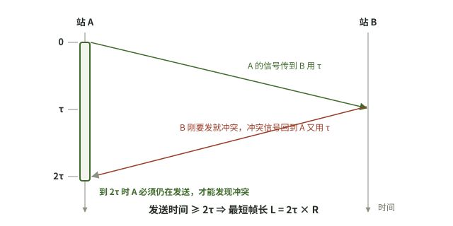

# 2026-10-10 计算机网络｜2010 真题整卷后的网络部分复盘

## 今天实际涉及

- 已作答（整卷，独立）：2010 年 408 真题。网络部分判错的是选择 34、36、39、40，大题 47 估 5/9。用户自己对答案并用红笔订正；答题卡原图含姓名，没有公开，作答由批改助手看原图后转述。
- 今天没有单独的讲解或追问，问答里只有整卷批改的两个小节。
- 待闭卷作答（未做）：17:52 两节的“检验”迁移题；前几天的 `2017-47` 隔日重做、`408-2009-47` 重做、`408-2009-39` 作答仍没有记录。
- 注意：`408-2010-47` 第 (2) 问的条件（2km、10Mbps、1518B 帧、64B 确认）和昨天看过解析的 `王道CN-3.6-综合` 一样，可能就是同一道题，待核实。昨天追问过“分子为什么是 1500×8”，今天整卷里仍然漏了传播时延，并把比值当成了速率。
- 本复盘由每晚 22:00 的定时任务依据当天问答整理，不是用户口述的总结。

## 题目状态

| 题目 | 状态 | 来源 | 卡点／错误步骤 → 更正 | 下次验证 |
|---|---|---|---|---|
| `408-2010-34` 存储转发：1000 个分组经 2 段链路的总时延（原题干未录入） | 作答待核实 | [17:52](../../问答记录/计算机网络/2026-10-10.md) | 选 A，只算了源点发完 → 还要加最后一个分组多走 2 段链路的 0.16ms，共 80.16ms，选 C | 闭卷做 17:52 检验 (b)（4 段链路、100 个分组） |
| `408-2010-36` 路由器因拥塞丢弃分组时发什么 ICMP 报文（原题干未录入） | 作答待核实 | [17:52](../../问答记录/计算机网络/2026-10-10.md) | 选 B → 应选 C，源点抑制；知识点不会 | 背 ICMP 差错报告报文 5 类，闭卷默写 |
| `408-2010-39` TCP 发送方还能发多少字节（原题干未录入） | 作答待核实 | [17:52](../../问答记录/计算机网络/2026-10-10.md) | 选 C，忘了减已发未确认 → min(4000, 2000) − 1000 = 1000B，选 A | 闭卷做 17:52 检验 (a)（拥塞窗口 6000B） |
| `408-2010-40` 递归查询时主机和本地域名服务器各发几条请求（原题干未录入） | 作答待核实 | [17:52](../../问答记录/计算机网络/2026-10-10.md) | 选 B → 应选 A：递归时主机只问本地服务器 1 次，本地服务器也只发 1 次 | 闭卷对比递归和迭代各发几条 |
| `408-2010-47` CSMA/CD 冲突检测时间与有效数据速率 | 作答待核实 | [17:52](../../问答记录/计算机网络/2026-10-10.md) | (1) 对；(2) 写成 1500/1582 → 周期还要加 2 × 0.01ms 传播时延，结果是速率不是比值：12000bit ÷ 1.2856ms ≈ 9.33Mbps | 闭卷做 17:52 检验（100Mbps、1km、1000B 帧） |

## 作答记录

| 编号 | 作答方式 | 作答内容／附件 | 核对结果 | 核对依据 | 来源 |
|---|---|---|---|---|---|
| `408-2010-34` | 独立 | 整卷答题卡原图（未公开），选 A | 错误 | 仅旧助手判断 | [17:52](../../问答记录/计算机网络/2026-10-10.md) |
| `408-2010-36` | 独立 | 整卷答题卡原图（未公开），选 B | 错误 | 仅旧助手判断 | [17:52](../../问答记录/计算机网络/2026-10-10.md) |
| `408-2010-39` | 独立 | 整卷答题卡原图（未公开），选 C | 错误 | 仅旧助手判断 | [17:52](../../问答记录/计算机网络/2026-10-10.md) |
| `408-2010-40` | 独立 | 整卷答题卡原图（未公开），选 B | 错误 | 仅旧助手判断 | [17:52](../../问答记录/计算机网络/2026-10-10.md) |
| `408-2010-47` | 独立 | 整卷答题卡原图（未公开）；转写见 [17:52 作答](../../问答记录/计算机网络/2026-10-10.md) | 部分正确 | 仅旧助手判断 | [17:52](../../问答记录/计算机网络/2026-10-10.md) |

- 选择题答案以用户红笔订正为准，47 由批改助手凭记忆对照评分标准估分。原图不在仓库，所以核对依据只能记“仅旧助手判断”。

## 知识点与适用条件

- **存储转发总时延**（忽略传播时延和处理时延，各段链路速率相同）：总时延 = 全部分组的发送时间 +（链路段数 − 1）× 一个分组的发送时间。源点发完最后一个分组后，这个分组还要在后面每一跳再被发送一次。链路段数 = 路由器数 + 1。
- **TCP 发送方还能发多少**：可发量 = min(拥塞窗口, 接收窗口) − 已发送但未确认的字节数。接收窗口取最新确认报文里通告的值。题目说“不考虑窗口增长”时，拥塞窗口按原值算。
- **ICMP 差错报告报文**：终点不可达、源点抑制（因拥塞丢弃分组）、时间超过（TTL 为 0）、参数问题、改变路由（重定向）。教材里的分类口径和页码待核实。
- **DNS 递归与迭代查询**：主机向本地域名服务器一般用递归查询，只发 1 次请求。本地服务器递归查询时，只向根服务器发 1 次，由上级逐级代查；迭代查询时，它要依次询问根、顶级、权限域名服务器，各发 1 次。
- **停等方式的有效数据速率**：
  - 有效数据速率 = 一个周期里的有效数据位数 ÷ 周期时间。
  - 周期 = 数据帧发送时延 + 确认帧发送时延 + 2 × 单程传播时延。
  - 有效数据只算 MAC 帧的数据部分。
  - 结果的单位必须是 bit/s，没有单位的比值是利用率，不是速率。
- **CSMA/CD 检测到冲突的时间**：两站同时发送时，检测时间最短为 τ（单程传播时延）；一站的信号快到时另一站才开始发，检测时间最长为 2τ。

## 我的卡点与纠正

- `408-2010-34`：只算了源点发完的 80ms → 漏了最后一个分组的后续转发 → 加（链路段数 − 1）× 0.08ms。
- `408-2010-39`：直接用 min(拥塞窗口, 接收窗口) → 漏了已发未确认的 1000B → 减去后为 1000B。
- `408-2010-47` (2)：1500/1582 → 周期没有按时间线列全，漏了来回两次传播；没检查单位 → 先画甲乙两条时间线，最后检查单位。这道题的同类题昨天已经追问过（`王道CN-3.6-综合`），今天仍然出错，说明看懂解析不等于会做，需要闭卷重写。
- `408-2010-36`、`408-2010-40`：分别是 ICMP 报文类型和 DNS 查询次数的知识点不会，没有更多作答细节，未复核。

## 闭卷自测

### 自测：迁移｜TCP 还能发多少字节

**题干**：TCP 连接的拥塞窗口为 6000B，MSS 为 1000B。甲已连续发出 3 个最大报文段，随后收到对第 1 个报文段的确认，确认报文中通告的接收窗口为 3000B。不考虑拥塞窗口因这次确认而增长，甲此时还能再发送多少字节？本题改编自 `408-2010-39`，不是原真题。

**参考要点**：
- 已发未确认：3000 − 1000 = 2000B。
- 可发量 = min(6000, 3000) − 2000 = 1000B。
- 易错：忘了减已发未确认，或者用发送前的接收窗口。

### 自测：迁移｜多跳存储转发的总时延

**题干**：主机 H1 到 H2 的路径上有 3 个路由器（共 4 段链路），各段链路速率都是 10Mbps。H1 把文件分成 100 个 1000B 的分组（不计首部），采用存储转发，忽略传播时延和处理时延。从 H1 开始发送第一个分组到 H2 收完最后一个分组，需要多少时间？本题改编自 `408-2010-34`，不是原真题。

**参考要点**：
- 一个分组的发送时间：8000bit ÷ 10⁷bit/s = 0.8ms。
- 总时延 = 100 × 0.8 + (4 − 1) × 0.8 = 80 + 2.4 = 82.4ms。
- 易错：只算 100 × 0.8；或者把每个分组都乘以 4 段链路。

### 自测：迁移｜停等方式的有效数据速率

**题干**：以太网速率 100Mbps，甲乙两站相距 1km，信号传播速度 200000km/s。甲发送一个 1000B 的帧，其中数据部分 980B；乙收完后立即回一个 64B 的确认帧，甲收到确认后才发下一帧。求甲的有效数据传输速率。本题改编自 `408-2010-47`，不是原真题。

**参考要点**：
- 数据帧发送时延 8000bit ÷ 10⁸bit/s = 0.08ms；确认帧发送时延 512bit ÷ 10⁸bit/s = 0.00512ms；单程传播时延 1km ÷ 200000km/s = 5μs，来回 0.01ms。
- 周期 = 0.08 + 0.00512 + 0.01 = 0.09512ms。
- 有效速率 = 980 × 8 bit ÷ 0.09512ms ≈ 82.4Mbps。
- 易错：分子用整帧长；漏了来回传播；给出没有单位的比值。

### 自测：CSMA/CD 检测到冲突要多久

**题干**：经典共享、半双工以太网速率 10Mbps，甲乙两站相距 1km，信号传播速度 200000km/s。(1) 甲乙都在发送时，从甲开始发送到甲检测到冲突，最短和最长各需要多少时间？(2) 若要求甲在发完一帧之前一定能检测到冲突，最短帧长是多少位？本题改编自 `408-2010-47` 第 (1) 问，不是原真题。

**参考要点**：
- 单程传播时延 τ = 1 ÷ 200000 s = 5μs。
- (1) 两站同时发送时最短为 τ = 5μs；乙在甲的信号快到时才开始发送，最长为 2τ = 10μs。
- (2) 发送时间要不小于 2τ：最短帧长 = 2τ × R = 10μs × 10Mbps = 100bit。
- 只适用于半双工共享介质；全双工交换式以太网不用 CSMA/CD。

### 自测：迁移｜递归查询和迭代查询各发几条请求

**题干**：用户主机要解析另一网络中某主机的域名。本地域名服务器没有缓存，需要依次经过根域名服务器、顶级域名服务器和权限域名服务器才能查到结果。(1) 若本地域名服务器采用递归查询，用户主机和本地域名服务器各发出几条域名请求？(2) 若本地域名服务器改用迭代查询，又各发出几条？本题改编自 `408-2010-40`，不是原真题。

**参考要点**：
- (1) 主机 1 条（递归问本地服务器）；本地服务器 1 条（只问根，由上级逐级代查）。
- (2) 主机仍是 1 条；本地服务器依次问根、顶级、权限服务器，共 3 条。
- 关键：主机到本地服务器一般都是递归查询；查询方式指的是本地服务器向上查询的方式。

## 下次先做

- [ ] `408-2010-47` 第 (2) 问的迁移检验：闭卷做 100Mbps、1km、1000B 帧那道题，先画甲乙两条时间线再列式，最后检查单位（同类题已经连续两天出现）。
- [ ] `408-2010-34`、`408-2010-39` 的迁移检验：闭卷做 17:52 的 (a) TCP 可发量、(b) 4 段链路存储转发。
- [ ] `2017-47`：隔日闭卷重做 4 问（2026-10-06 部分正确，已拖四天）；`408-2009-47` 重做和 `408-2009-39` 作答排在它之后。

## 来源与边界

- [2026-10-10 计算机网络问答](../../问答记录/计算机网络/2026-10-10.md)：17:52 两节。
- [2010 真题考试记录](../../考试记录/2026-10-10_408_2010真题.md)：只用于说明整卷背景，考试记录本身不改变题目状态。
- 34、36、39、40 的原题题干和选项没有录入问答，题意根据批改要点整理；47 的题干是凭记忆整理的。
- `408-2010-47` 和 `王道CN-3.6-综合` 是否为同一道题待核实。
- ICMP 报文分类和 DNS 查询次数按常见教材口径整理，页码待核实；自测改编题的数值是助手计算的结果，没有对照原书核对。
- 今天问答里的“检验”题还没作答，所以没有在问答小节补“检验结果”。
