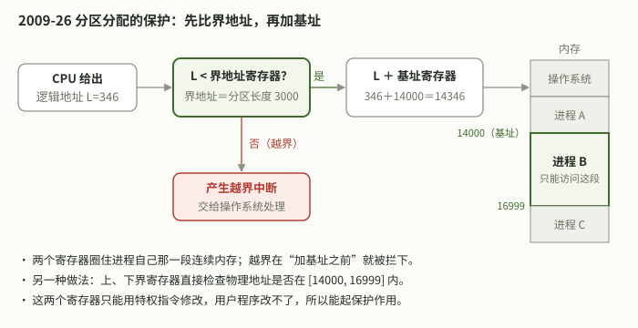
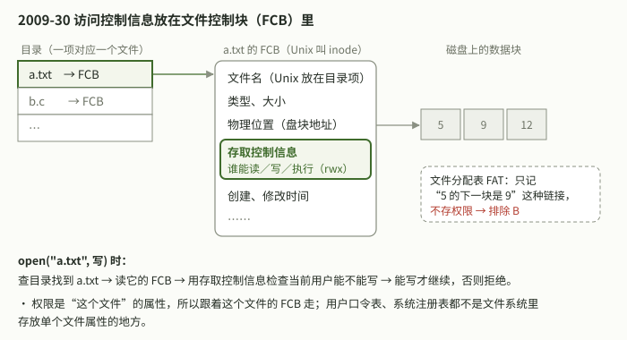
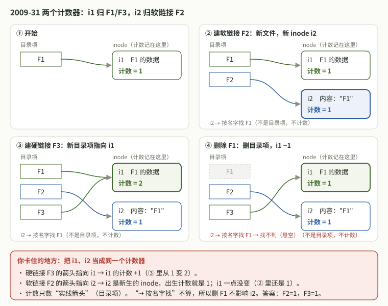

# 2026-10-09 操作系统｜问答记录

科目：操作系统。时间为北京时间。

## 14:47　`408-2009-25`　打印机资源与死锁的最小进程数

**问**：09年选择25。

**题**（按助手记忆整理，未对照真题册，待核实）：某计算机系统中有 8 台打印机，由 K 个进程竞争使用，每个进程最多需要 3 台打印机。该系统可能会发生死锁的 K 的最小值是：A 2　B 3　C 4　D 5。

**作答**：本次没有作答，用户直接要讲解。这道题不在 2026-10-08 记录的操作系统错题里（错题为 28、31、45、46），整卷中所选选项未知。

**答**：选 C（K=4）。考虑最坏情况：每个进程各拿到 m−1=2 台，再等最后 1 台。总数 R ≥ K(m−1)+1 时一定不会死锁，所以 8 ≥ 2K+1 → K ≤ 3。K=3 时还剩 2 台，不会死锁；K=4 时 4×2=8 台恰好分完，每个进程都差 1 台，可能死锁。

**通用公式**：K 个进程，每个最多需要 m 个同类资源，总数 R。R ≥ K(m−1)+1 时一定不会死锁；问“可能死锁的最小 K”时，取使该式不成立的最小 K。

**核实**：答案和推导由本助手给出，题面待对照真题册。

## 14:52　`408-2009-26`、`408-2009-30`　分区分配的保护措施；文件访问控制信息放在哪

**问**：26题30题是哪块内容我有点陌生。

**题**（26，按助手记忆整理，未对照真题册，待核实）：分区分配内存管理方式的主要保护措施是：A 界地址保护　B 程序代码保护　C 数据保护　D 栈保护。

**题**（30，按助手记忆整理，未对照真题册，待核实）：文件系统中，文件访问控制信息存储的合理位置是：A 文件控制块　B 文件分配表　C 用户口令表　D 系统注册表。

**作答**：本次未作答，用户问的是这两题属于哪块内容。整卷中所选选项未知，两题不在 10-08 的错题记录里。

**答**：
- 26 属于第 3 章内存管理中连续分配的内存保护，选 A。分区分配让每个进程占一段连续内存，用重定位（基址）寄存器加界地址（限长）寄存器保护：逻辑地址先和界地址比较，越界就中断，否则加基址得到物理地址；也可以用上、下界寄存器检查物理地址。B、C、D 只说了保护什么，没说用什么机制。
- 30 属于第 4 章文件管理中的文件控制块和文件保护，选 A。FCB 存文件名、类型、物理位置、大小、存取控制信息和时间等；Unix 把除文件名外的信息放在 inode 里，权限即 rwx 位。FAT 只记录盘块链接，口令表和注册表都不是存放单个文件属性的地方。

**核实**：答案和讲解由本助手给出，题面待对照真题册。

## 14:54　`408-2009-26`、`408-2009-30`　画图过一遍

**问**：画图带我过一下几个。（随后补充：26、30）

**题**：同 14:52 小节（题面按助手记忆整理，待核实）。

**作答**：本次未作答，是看图讲解。

**答**：

26：CPU 给出逻辑地址 L，先和界地址寄存器（分区长度）比较，越界就产生中断交给操作系统；不越界再加基址寄存器得到物理地址。两个寄存器只能用特权指令修改。图中的 346、14000、3000 是讲解用的示例数。

30：目录项指向文件的 FCB（Unix 中叫 inode），FCB 里有类型、大小、物理位置、存取控制信息（rwx）和时间等。open 时先查目录、再读 FCB、按存取控制信息检查权限。FAT 只记录盘块链接，不存权限。

**核实**：图和讲解由本助手给出，题面待对照真题册。

## 15:09　`408-2009-31`　软链接、硬链接与引用计数

**问**：31题不懂。

**题**（按助手记忆整理，未对照真题册，待核实）：设文件 F1 的当前引用计数为 1，先建立 F1 的符号链接（软链接）文件 F2，再建立 F1 的硬链接文件 F3，然后删除 F1。此时 F2 和 F3 的引用计数值分别是：A 0，1　B 1，1　C 1，2　D 2，1。

**作答**：10-08 整卷中此题判错（见 10-08 16:51 小节），所选选项未转录。本次未重新作答，直接要讲解。

**答**：选 B。引用计数记在 inode 上，表示有几个目录项指向它。硬链接是新目录项指向同一个 inode，计数 +1；软链接是一个新文件，有自己的 inode，内容是路径 "F1"，不改变 F1 的 inode 计数。

1. 开始：F1 → i1，i1 计数 1。
2. 建软链接 F2：F2 → 新 inode i2（内容 "F1"），i2 计数 1；i1 仍为 1。
3. 建硬链接 F3：F3 → i1，i1 计数 2。
4. 删除 F1：删掉目录项，i1 计数减为 1，不为 0，inode 和数据保留。

所以 F2 计数 1（悬空链接，访问会失败但计数不变），F3 计数 1。

**常见误区**：认为删 F1 后 F2 计数变 0（A）；忘了删除 F1 会让 i1 减 1，以为 F3 是 2（C）。

**核实**：答案和讲解由本助手给出，题面待对照真题册。

## 15:12　`408-2009-31`　追问：软链接自己的 inode 计数为什么是 1

**问**：（引用上一节“新 inode i2（内容是 "F1"），i2 计数 = 1”）这个为什么也是1？

**作答**：本次是追问，未作答。

**答**：F2 本身是一个普通的新文件。新建文件时系统给它分配 inode，并在目录里放一个指向它的目录项。指向 i2 的目录项只有 “F2” 一个，所以计数为 1，和 F1 新建时计数为 1 是同一个道理。软链接只是文件内容为路径 "F1"，访问时按名字再去找 F1，并没有目录项指向 i1，所以不改变 i1 的计数，i2 的计数也和 F1 无关。反例：再给 F2 建硬链接 F4，F4 指向 i2，i2 计数变为 2。

**核实**：讲解由本助手给出。

## 15:14　`408-2009-31`　追问：软链接“不加”又“是 1”是否矛盾

**问**：为什么软连接不加只有硬连接加，但是软连接在创立的时候也加1？

**作答**：本次是追问，未作答。卡点：把 i1（F1 的 inode）和 i2（软链接自己的 inode）两个计数当成同一个计数。

**答**：有两个不同的计数器。i1 的计数数的是指向 i1 的目录项：硬链接 F3 指向 i1，所以 i1 从 1 变成 2；软链接 F2 的目录项指向 i2，不改变 i1。i2 是新建的 inode，新文件建好计数就是 1，不是从 0 加上来的，也和 i1 无关。“软链接不加”是指不加原文件的计数；“软链接计数是 1”是它自己的计数。比喻：硬链接是给同一个房间多配一把钥匙；软链接是另盖一个小房间，里面贴纸条“去 F1”，小房间有自己的 1 把钥匙。题目问 F2 的计数，就是 i2 的计数，等于 1。

**核实**：讲解由本助手给出。

## 15:16　`408-2009-31`　画图诊断：引用计数记在哪个 inode 上

**问**：你看看我哪里理解有问题，画出来帮我理解。

**作答**：本次未作答。

**诊断**（助手根据 15:12、15:14 两次追问推断）：把引用计数当成全局只有一个数，于是把软链接新 inode 的计数 1 理解成“加了 1”，和“软链接不加计数”矛盾。

**答**：

每个 inode 有自己的计数，只数指向它的目录项。绿色 i1 只受指向它的 F1、F3 影响；蓝色 i2 是软链接新建的 inode，出生计数就是 1。“按名字找 F1”不是目录项，不计数。判断方法：看这个目录项的箭头指向哪个 inode，计数就记在那个 inode 上。

**核实**：图和讲解由本助手给出，题面待对照真题册。
