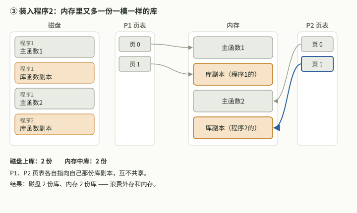
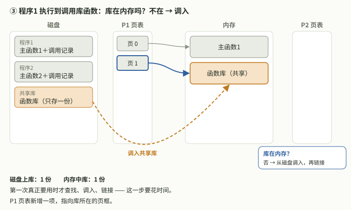
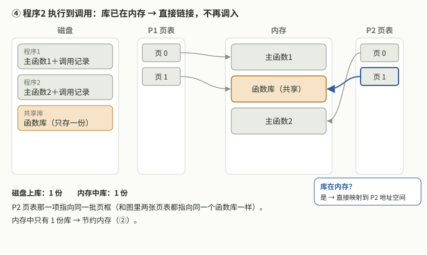
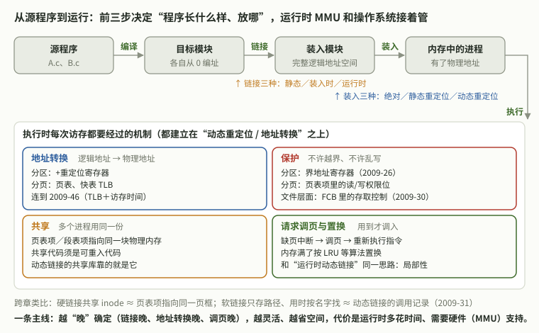
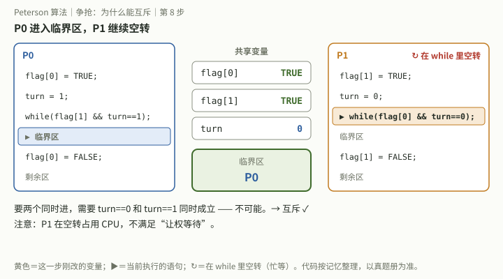
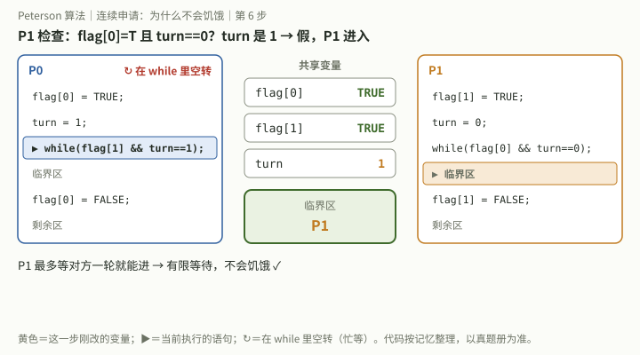

## 08:13　`零壹考研视频-内存管理-动态链接优点`　动态链接相比静态链接的优点

**问**：这个讲讲。（上传了零壹考研课程视频截图，截图未公开存档）

**题**：相比于静态链接方式，动态链接的优点包括（　）。①节约外存空间　②节约内存空间　③加快地址转换。A ①②③　B ②　C ①②　D ①③。（题干按截图逐字转录；截图中配图为磁盘上一份函数库、内存中一份函数库，P1、P2 两张页表各有一项指向同一份函数库，旁注“运行时动态链接：装入程序时，并不检查其依赖的函数库是否放入内存，而是等需要调用共享库中的内容的时候再检查已经在内存中，若不在则调入，若在则直接将其链接到自身地址空间”。截图未给出题号和答案。）

**作答**：本次未作答，直接要讲解。

**答**：选 C。静态链接把库函数复制进每个可执行文件，几个程序用同一个库，磁盘上和内存里就各有几份。动态链接的可执行文件里只记录要用哪个库，库在磁盘上和内存里都只有一份。
- ① 对：可执行文件不再各带一份库代码，节约外存。
- ② 对：内存里只有一份函数库，P1、P2 页表中的对应项指向同一批页框，共享代码。
- ③ 错：地址转换由 MMU 查页表、TLB 完成，与链接方式无关；运行时动态链接要在首次调用时查找、装入、链接，反而更花时间，是用时间换空间。

补充：运行时动态链接是执行到调用时才检查并调入、链接；装入时动态链接是在装入内存时边装入边链接。

**核实**：答案和讲解由本助手给出，截图中没有给出官方答案，待对照课程答案。

## 08:14　`零壹考研视频-内存管理-动态链接优点`　分步动画：静态链接 vs 运行时动态链接

**问**：画图细致一些动态。

**作答**：本次未作答。

**答**：在线程里做了可以逐步点击或自动播放的动画。静态链接 3 步：编译时把库复制进每个可执行文件 → 装入程序1（连同库副本）→ 装入程序2（内存里再多一份库副本），结果磁盘 2 份库、内存 2 份库。运行时动态链接 5 步：可执行文件只记调用记录，磁盘只有 1 份共享库 → 装入程序1 只装主函数 → 执行到调用时发现库不在内存，调入并让 P1 页表一项指向它 → 程序2 执行到调用时库已在内存，P2 页表一项直接指向同一批页框 → 小结：磁盘、内存各 1 份库，代价是首次调用时查找和链接的时间。仓库只存了三张关键帧：







**核实**：图和讲解由本助手给出。

## 08:18　`零壹考研视频-内存管理-动态链接优点`　由动态链接串联的知识点

**问**：这里还能帮我串哪些知识点？

**作答**：本次未作答。

**答**：
1. 编译 → 链接 → 装入。链接分静态链接、装入时动态链接、运行时动态链接；装入分绝对装入、可重定位装入（静态重定位）、动态运行时装入（动态重定位，需要重定位寄存器）。易混：动态链接管“库何时接入”，动态重定位管“地址何时变成物理地址”。
2. 重定位（基址）寄存器加界地址寄存器就是分区分配的保护措施，接 `408-2009-26`（2026-10-09 14:52、14:54）。
3. 共享：分页共享是不同进程的页表项指向同一页框；分段共享是段表项指向同一段，段是逻辑单位，更易共享；共享代码必须是可重入代码（纯代码）。fork 的写时复制也是先共享页框，写时再复制。
4. 运行时动态链接“调用时才装库”，和请求分页“访问时才调页”同理，都基于局部性原理。
5. 文件共享：硬链接共享同一 inode，类似页表项指向同一页框；软链接只存路径、用时按名字查找，类似动态链接的调用记录；原文件删除后软链接悬空。接 `408-2009-31`（2026-10-09 15:09～15:16）。

**核实**：讲解由本助手给出。

## 08:23　`零壹考研视频-内存管理-动态链接优点`　追问：三种链接、三种装入展开讲；完善总图

**问**：（引用“链接三种……装入三种……”）展开讲讲，很模糊。（引用“编译 → 链接 → 装入 → 共享”）还能完善吗？

**作答**：本次未作答。卡点（用户自述）：三种链接、三种装入的区别模糊。

**答**：用同一个例子讲：模块 A（0～199，含 call B）和模块 B（0～99）编译后各自从 0 编址。

链接管“什么时候拼成一个整体”：
- 静态链接：运行前一次拼好，A 放 0～199、B 接在 200～299，call B 改成 call 200，库也拷进来；改模块要重新链接，每个程序各带一份库。
- 装入时动态链接：装入内存时边装边拼；模块在磁盘上分开存放，便于修改、升级和共享。
- 运行时动态链接：执行到 call B 才去找 B、装入、链接；没调用到的模块不装，装入快、省内存，首次调用多花时间。

装入管“逻辑地址什么时候换成物理地址”（装入模块 0～299 放到 1000 开始）：
- 绝对装入：编译时就定死，程序里直接是 1000～1299；只适合单道。
- 可重定位装入（静态重定位）：装入时所有地址 +1000，一次改好；需一次分到全部连续内存，运行中不能移动。
- 动态运行时装入（动态重定位）：内存中仍是 0～299，每次访问时物理＝逻辑＋重定位寄存器（1000）；可对换、紧凑，配合界地址寄存器保护（`408-2009-26`）。

易混：动态链接的“动态”指库何时接入；动态重定位的“动态”指地址何时转换。


完善后的总图：源程序 →编译→ 目标模块 →链接→ 装入模块 →装入→ 内存中的进程 →执行；执行时有地址转换（重定位寄存器、页表、TLB，接 `408-2009-46`）、保护（界地址寄存器 `408-2009-26`、页表项权限位；文件层面 FCB 存取控制 `408-2009-30`）、共享（页表项／段表项指向同一物理内存，可重入代码）、请求调页与置换（缺页、LRU，局部性）。跨章类比：硬链接 ≈ 页表项指向同一页框，软链接 ≈ 动态链接的调用记录（`408-2009-31`）。主线：越晚确定越灵活、越省空间，代价是运行时间和硬件支持。



**核实**：讲解和图由本助手给出，示例数字为讲解用。

## 17:52　408-2010 整卷选择题错题（26、27、29、30、32）

**作答**：独立整卷作答，用户自己对答案并用红笔订正。26 选 C（应 A），27 选 A（应 D），29 选 D（应 B），30 选 D（应 C），32 选 C（应 B）。

**正确要点**：26 时间片用完时降优先级。27 是 Peterson 算法，能互斥也不会饥饿。29 每页放 2¹⁰/2 = 2⁹ 个页表项，页目录 2¹⁶/2⁹ = 128 项。30 每块放 256/4 = 64 个地址，最大 (4 + 2×64 + 64²) × 256B = 1057KB。32 键盘输入先由中断处理程序取得。

**漏洞**：两道计算题都卡在“一块（一页）能放几个地址项”这一步：页目录项数 = 页数 ÷ 每页页表项数；索引结点最大文件 = 能指向的数据块总数 × 块大小。

**补法**：做这类题先写“一块能放 块大小 ÷ 项大小 个项”，再往上一层层乘。Peterson 算法记住 flag 表意愿、turn 表谦让，两者合起来才能既互斥又不饥饿。

**检验**（迁移题，不重做原题）：(a) 页大小 4KB，页表项 4B，逻辑地址空间 2²⁰ 页，二级页表的页目录有几项？(b) 索引结点有 10 个直接地址、1 个一级间接、1 个二级间接，块 1KB、地址项 4B，单个文件最大多大？

来源：2026-10-10 17:52 用户在项目对话上传的 2010 年 408 试卷和答题卡照片（含姓名，未公开）。作答由批改助手看原图后转述；选择题答案按用户红笔订正；大题估分按 2010 官方评分标准凭记忆，未对答案册逐条核。整卷见[考试记录](../../考试记录/2026-10-10_408_2010真题.md)。

## 17:52　`408-2010-45`　位示图、磁盘访问时间与 Flash 调度

**题**（题意凭记忆整理）：用 2KB 内存记录 16384 个磁盘块的空闲状态。(1) 用什么方法；(2) 转速 6000r/min，每道 100 扇区，相邻磁道移动 1ms；磁头在 100 号、向增大方向移动，请求 50、90、30、120，各读 1 个随机扇区，CSCAN 共需多少时间；(3) 换成 Flash 用什么调度，为什么。

**作答**：(1) 位示图对。(2) 写“1r = 0.1ms”，(20+60) × 1ms + 0.1ms × 4 = 80.4ms。(3) 写了 LRU 后划掉。

**批改**：估 3/7。(2) 移动 100→120→30→50→90 共 170 道 = 170ms；一圈 10ms，平均旋转延迟 5ms × 4 = 20ms；读一个扇区 0.1ms × 4 = 0.4ms；共 190.4ms。(3) Flash 没有寻道和旋转，用 FCFS。错因：计算漏步。

**正确要点**：磁盘访问时间 = 寻道时间 + 旋转延迟（半圈）+ 传输时间，三项都要算。LRU 是页面置换算法，不是磁盘调度。

**漏洞**：访问时间只算了寻道和传输，漏了旋转延迟；转一圈的时间和读一个扇区的时间混了。和 2009-46 漏访存是同一类：时间题没有按流程逐项列。

**补法**：时间题先写公式“寻道 + 旋转 + 传输”，每项旁边写单次时间和次数，再相加。见[跨科串联表](../../串联/408跨科串联.md)第 12 条。

**检验**（迁移题，不重做原题）：转速 7200r/min，每道 200 扇区，相邻磁道移动 0.5ms。磁头在 50 号、向增大方向，请求 70、20、90、40 号磁道各读 1 个随机扇区，CSCAN（回扫距离也算）共需多少时间？换成 Flash 用什么调度？

来源：2026-10-10 17:52 用户在项目对话上传的 2010 年 408 试卷和答题卡照片（含姓名，未公开）。作答由批改助手看原图后转述；选择题答案按用户红笔订正；大题估分按 2010 官方评分标准凭记忆，未对答案册逐条核。整卷见[考试记录](../../考试记录/2026-10-10_408_2010真题.md)。

## 17:52　`408-2010-46`　FIFO 与 CLOCK 置换后的物理地址

**题**（题意凭记忆整理）：逻辑和物理地址空间都是 64KB，页大小 1KB，进程分到 4 个页框；页 0、1、2、3 分别在页框 7、4、2、9，装入时刻 130、230、200、160。时刻 260 访问 17CAH。(1) 页号；(2) FIFO 时的物理地址；(3) CLOCK（从 2 号页框开始扫描，访问位都是 1）时的物理地址。

**作答**：(1) 页号 5 对。(2) 写“页 2 → 页框 2”，07CAH。(3) 写“转 5 次指到 1 号页 → 4 号页框”，13CAH。

**批改**：估 2/8。(2) FIFO 换装入最早的 0 号页（130），页框 7，物理地址 1FCAH。(3) CLOCK 从 2 号页框开始，访问位全 1，转一圈全部清零后回到 2 号页框把它换出，物理地址 0BCAH。错因：概念不清。

**正确要点**：FIFO 只看装入时刻，选最早的；CLOCK 从指针处开始扫，访问位为 1 就清零跳过，第一个为 0 的被换出。物理地址 = 页框号拼上页内偏移（低 10 位）。

**漏洞**：两种置换算法的选择规则都没用对：FIFO 选的不是装入最早的页；CLOCK 没有从指针所在页框开始扫，也不清楚访问位全 1 时会回到起点。

**补法**：把页表按装入时刻排序后再选 FIFO；CLOCK 在纸上画一个环，按页框顺序标出指针和访问位，一步步清零。

**检验**（迁移题，不重做原题）：同上题，但装入时刻改为 230、130、200、160（页 0～3），CLOCK 仍从 2 号页框开始、访问位都是 1。访问逻辑地址 1BCDH，分别用 FIFO 和 CLOCK 求物理地址。

来源：2026-10-10 17:52 用户在项目对话上传的 2010 年 408 试卷和答题卡照片（含姓名，未公开）。作答由批改助手看原图后转述；选择题答案按用户红笔订正；大题估分按 2010 官方评分标准凭记忆，未对答案册逐条核。整卷见[考试记录](../../考试记录/2026-10-10_408_2010真题.md)。

## 19:57　`408-2010-26`　降低进程优先级的合理时机

**问**：去看看最新的错题，26题。

**题**（按助手记忆整理，未对照真题册，待核实）：下列选项中，降低进程优先级的合理时机是：A 进程的时间片用完　B 进程刚完成 I/O，进入就绪队列　C 进程长期处于就绪队列中　D 进程从就绪态转为运行态。

**作答**：独立整卷作答选 C，答案 A（见本日 17:52 小节，作答由批改助手看原图转述，用户红笔订正）。本次未重做。

**答**：判断标准是进程“占 CPU 多”还是“被亏待”。A 时间片用完说明是 CPU 型进程，降低优先级让别人运行，多级反馈队列中时间片用完就降到下一级队列。C 长期在就绪队列应提高优先级（老化，防饥饿），方向与题目相反。B 刚完成 I/O 是 I/O 型进程，一般提高优先级，让设备和 CPU 并行忙起来。D 只是被调度上 CPU，没有调整理由。

**漏洞**（助手根据所选 C 推断）：把“长期等待”当作降优先级的理由；调度中等待是补偿（升）的理由，不是惩罚的理由。

**核实**：答案按用户红笔订正和考试记录；讲解由本助手给出，题面待对照真题册。

## 20:04　`408-2010-27`　Peterson 算法：能否互斥、会否饥饿

**问**：27。

**题**（按助手记忆整理，未对照真题册，待核实）：进程 P0、P1 共享变量 flag[2]、turn，初值 flag[0]=flag[1]=FALSE，turn=0 或 1。

```c
P0: flag[0]=TRUE; turn=1;          P1: flag[1]=TRUE; turn=0;
    while(flag[1] && turn==1);         while(flag[0] && turn==0);
    临界区;                             临界区;
    flag[0]=FALSE;                      flag[1]=FALSE;
```

则并发执行时：A 不能保证互斥，会饥饿　B 不能保证互斥，不会饥饿　C 能保证互斥，会饥饿　D 能保证互斥，不会饥饿。

**作答**：独立整卷作答选 A，答案 D（见本日 17:52 小节，作答由批改助手看原图转述，用户红笔订正）。本次未重做。

**答**：这是 Peterson 算法，选 D。
- 互斥：若两者同在临界区，两个 while 条件都不成立；此时 flag 都为 TRUE，只能靠 turn 放行，但 turn 不能同时为 0 和 1，最后写 turn 的进程把机会让给对方、自己等待。
- 不饥饿（有限等待）：P1 等待时，P0 退出置 flag[0]=FALSE，P1 即可进入；P0 若再申请会先置 turn=1 谦让，所以 P1 最多等一轮。对方不想进时自己直接进入，满足空闲让进。
- 对比：单标志法违反空闲让进；双标志先检查不能互斥；双标志后检查能互斥但可能都进不去；Peterson 用 turn 打破僵局。
- 陷阱：Peterson 在 while 中忙等，不满足让权等待。

**漏洞**（助手根据所选 A 推断）：没认出 Peterson 结构，可能与双标志先检查混淆，没有用“两者同时进入需要 turn 同时取两个值”这一步去验证互斥。

**核实**：答案按用户红笔订正和考试记录；讲解由本助手给出，题面代码待对照真题册。

## 20:09　`408-2010-27`　Peterson 算法分步动画

**问**：画图动态。

**作答**：本次未作答。

**答**：在线程里做了可逐步点击、自动播放的动画，三个场景：
1. 争抢：P0、P1 都置 flag 为 TRUE，各自写 turn=对方；最后写 turn 的 P1 把机会让给 P0，P0 的 while 条件为假进入临界区，P1 空转；P0 退出置 flag[0]=FALSE 后 P1 进入。两者同时进入需要 turn 同时为 0 和 1，不可能，所以互斥。
2. 连续申请：P0 退出后马上再申请，必须先写 turn=1，自己的 while 条件变真而等待，P1 的条件变假进入，P1 最多等一轮，不饥饿。
3. 空闲让进：P1 的 flag 为 FALSE 时，P0 的 while 条件直接为假，立即进入。

仓库存了两张关键帧：





**核实**：动画和讲解由本助手给出，代码待对照真题册。
