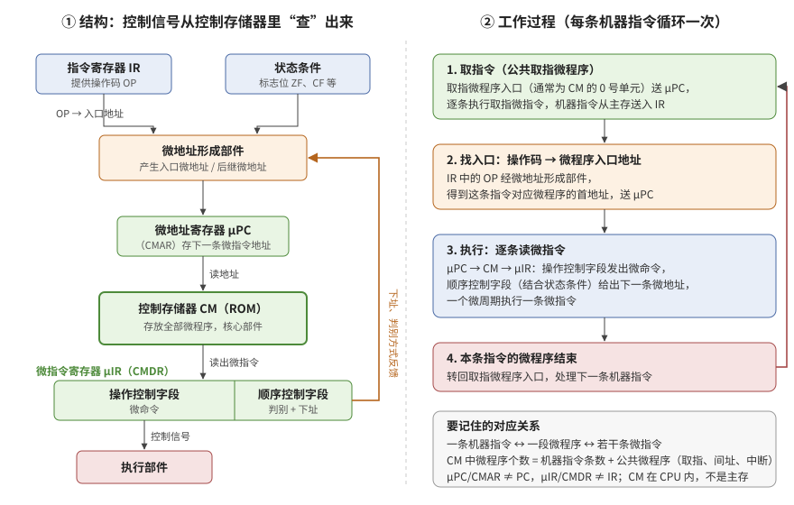

# 2026-10-09 问答记录

科目：计算机组成原理。时间为北京时间。

## 14:06　`408-2009-13`　浮点数加法（阶码、尾数均为补码）

**问**：13题

**题**：浮点数加、减运算过程一般包括对阶、尾数运算、规格化、舍入和判断溢出等步骤。设浮点数的阶码和尾数均采用补码表示，且位数分别为 5 和 7（均含 2 位符号位）。若有两个数 X = 2⁷ × 29/32 和 Y = 2⁵ × 5/8，则用浮点加法计算 X + Y 的最终结果是（ ）。
A. 001111100010　B. 001110100010　C. 010000010001　D. 发生溢出

（取自项目资料《王道计算机组成原理》（2027 版）第 2 章 2009 统考真题；文字版 OCR 把 X 的尾数识别成“2⁹/32”，按真题原文应为 29/32。用户只发题号，按 2009 卷顺序推定为此题，未与用户手上的版本核对。2026-10-08 考试记录里本科判错的选择题只有 17，本题整卷对错未记录。）

**答**：按项目约定，只发题号未作答时先给提示：先把 X、Y 写成“阶码 + 尾数”的二进制补码，再按 对阶（小阶向大阶看齐）→ 尾数相加 → 规格化 → 舍入 → 判溢出 五步走，重点看尾数相加后有没有超出 1、阶码加 1 后是否超过 5 位补码的表示范围。询问用户先自己做还是直接讲。

是否独立作答：未作答。

## 14:08　`408-2009-13`　直接讲：浮点加法的五步与溢出判断

**问**：直接讲

**答**：答案 D（发生溢出）。答案依据为助手推导，并与王道该题选项对照；未核用户原卷。

- 已知量：阶码 5 位、尾数 7 位，均为补码且含 2 位符号位（双符号位）。阶码数值 3 位，表示范围 −8～+7；尾数数值 5 位。双符号位：00 正、11 负、01 正溢出、10 负溢出。
- ① 表示：X 阶码 7 = 00 111，尾数 29/32 = 00.11101；Y 阶码 5 = 00 101，尾数 5/8 = 00.10100。
- ② 对阶：阶差 2，Y 尾数右移 2 位为 00.00101，阶码取 00 111；移出位为 00，无精度损失。
- ③ 尾数相加：00.11101 + 00.00101 = 01.00010，符号位 01 表示尾数大于 1，需要右规，尚不是浮点溢出。
- ④ 右规：尾数 00.10001，阶码 00 111 + 1 = 01 000。
- ⑤ 判溢出：阶码双符号位为 01，正溢出（8 超出 −8～+7），选 D。
- 验算：X + Y = 2⁷ × 34/32 = 2⁸ × 17/32，阶码需要 8，无法表示。
- 要点：尾数溢出（01.xxx 或 10.xxx）→ 右规、阶码加 1；阶码溢出才是浮点运算的溢出。

**检验**（改编，不是原题）：格式不变，X = 2⁶ × 29/32，Y = 2⁴ × 5/8，求 X + Y 的 12 位机器码，并判断是否溢出。待用户闭卷作答。

是否独立作答：本条为讲解，无作答。

## 14:09　`408-2009-13`　追问：尾数怎么快速表示

**问**：尾数怎么快速表示（附截图：讲解中“尾数 29/32 = 0.11101 → 00.11101”“尾数 5/8 = 0.101 → 00.10100”两行）

**答**：
- 分母为 2ⁿ 时，小数点后写 n 位，分子写成二进制填入：29/32，32 = 2⁵，29 = 11101 → 0.11101；5/8，8 = 2³，5 = 101 → 0.101。
- 分子位数不足 n 位时左边补 0（如 3/32 = 0.00011）；尾数数值位数多于 n 时右边补 0（5/8 补到 5 位为 0.10100）。左补 0 凑分母要求的位数，右补 0 凑题给尾数位数。
- 正数加符号位 00；负数（补码）先写正数，从右往左第一个 1 及其右侧不变，左侧全部取反：−5/8 → 00.10100 → 11.01100。
- 分母不是 2 的幂：乘 2 取整，如 0.75 → 0.11。

**检验**（自编小题）：用 7 位尾数（含 2 位符号位）写出 13/16 和 −3/8 的补码。待用户作答。

是否独立作答：本条为讲解，无作答。

## 14:13　`408-2009-13`　追问：尾数相加后右规、阶码加一

**问**：尾数相加右规解码加一这个忘记了

**答**：
- 原理：浮点数 = 尾数 × 2^阶码。尾数相加得 01.00010 表示尾数 ≥ 1，超出范围。尾数右移 1 位（÷2）、阶码加 1（2^阶码 × 2），值不变。十进制类比：12.5 × 10³ → 1.25 × 10⁴。
- 何时右规：尾数双符号位不同（01 或 10），右规 1 次即可。01.00010 → 00.10001；10.xxxxx → 11.0xxxx；右移时最高符号位保持不变，原低符号位移入数值位。阶码 +1。
- 左规：尾数第一个数值位与符号位相同（如 00.0xxxx、11.1xxxx）时左移 1 位、阶码 −1，重复直到 00.1xxxx 或 11.0xxxx。
- 口诀：右规一次阶码加一，左规几次阶码减几；右规后要检查阶码是否溢出（2009-13 即在此溢出）。

**检验**（自编小题）：尾数相加得 00.00110，阶码 00 011。左规几次？规格化后尾数和阶码各是多少？待用户作答。

是否独立作答：本条为讲解，无作答。

## 14:22　`CO-控制器-01`　区分微程序控制器和硬布线控制器

**问**：区分一下微程序控制器和硬布线控制器

**答**：区别在控制信号从哪来。

| | 硬布线控制器 | 微程序控制器 |
|---|---|---|
| 控制信号产生 | 组合逻辑电路由操作码、节拍信号、状态标志直接产生 | 微指令事先存于控制存储器（CM），执行时逐条读出 |
| 核心部件 | 节拍发生器、组合逻辑网络 | CM、微地址寄存器 μAR、微指令寄存器 μIR、微地址形成部件 |
| 速度 | 快（门电路延迟） | 慢（每步访问 CM） |
| 修改、扩展指令 | 难，需重新设计电路 | 容易，改写微程序 |
| 设计 | 复杂、不规整 | 规整、易设计调试 |
| 典型用途 | RISC | CISC |

关联：`408-2009-17` 选项 A“RISC 普遍采用微程序控制器”错，RISC 多用硬布线。

**检验**（原题，取自《王道计算机组成原理》（2027 版）第 5 章所收 2009 统考真题，在 2009 卷中的题号未核对）：相对于微程序控制器，硬布线控制器的特点是（ ）。A. 指令执行速度慢，指令功能的修改和扩展容易　B. 指令执行速度慢，指令功能的修改和扩展难　C. 指令执行速度快，指令功能的修改和扩展容易　D. 指令执行速度快，指令功能的修改和扩展难。待用户作答；`408-2009-17` 也仍待作答。

是否独立作答：本条为讲解，无作答。

## 14:32　`CO-控制器-02`　画微程序控制器的结构和工作图

**问**：画一下微程序控制器的结构和工作图

**答**：

- 结构：IR 的操作码、状态条件和 μIR 的顺序控制字段 → 微地址形成部件 → 微地址寄存器 μPC（CMAR）→ 控制存储器 CM → 微指令寄存器 μIR（CMDR）。μIR 的操作控制字段发出微命令（控制信号）给执行部件，顺序控制字段反馈给微地址形成部件。
- 工作过程：① 取指微程序（入口通常为 CM 的 0 号单元）把机器指令取入 IR；② 操作码经微地址形成部件得到该指令微程序的入口地址，送 μPC；③ 逐条从 CM 读微指令到 μIR 执行；④ 微程序结束，转回取指入口。
- 对应关系：一条机器指令对应一段微程序，一段微程序由若干条微指令组成；CM 中微程序个数 = 机器指令条数 + 公共微程序数（取指、间址、中断等）。μPC/CMAR 不是 PC，μIR/CMDR 不是 IR，CM 在 CPU 内部，不是主存。
- 来源：依据《王道计算机组成原理》（2027 版）第 5 章“微程序控制器的组成和工作过程”文字重绘，不是原书图 5.15 的复制。

是否独立作答：本条为讲解，无作答。

## 14:36　`CO-控制器-03`　PPT 里微程序控制器的重点

**问**：看ppt了吗，题到什么重点了

**答**：14:32 的图依据王道文字版，当时未看 PPT。随后阅读项目资料《计组强化2-指令+微指令PPT》（“微程序控制器回顾”“指令+微程序模型”两节）与《第七章_CU与ALU_PPT》（微指令编码方式部分），重点：

1. 考法两个方向（强化 PPT“往年真题举例”）：给指令条数和每条指令的微指令数，求下地址字段位数；给编码方式，求操作控制字段长度。PPT 例：100 条指令，每条平均 7 条微指令，其中 3 条公共取指 → 4 × 100 + 3 = 403 条 → 下地址 9 位。
2. 编码方式：直接控制每个微命令 1 位；字段直接编码将互斥微命令放同一字段、相容微命令放不同字段，每字段留一个“不操作”状态，3 位最多表示 7 个微命令。
3. 微指令格式：操作控制字段 | 判断测试字段 | 下地址字段；长度为三段之和，PPT 例为 18 + 2 + 7 = 27 位。
4. 审题：“每条指令平均需 n 条微指令”一般指执行部分（有间址时含间址），取指微程序公用、单独计数。
5. 最后一条微指令的下地址指向取指微程序首地址（PPT 例 0000H）。
6. 创新方向：不给控制信号个数，结合数据通路图数出控制信号，再按直接编码求控制字段位数。
7. 硬布线多配 RISC（如 MIPS），微程序多配 CISC（如 x86）。

**检验**（2012 统考真题，题干取自《王道计算机组成原理》（2027 版）第 5 章）：某计算机的控制器采用微程序控制方式，微指令中的操作控制字段采用字段直接编码法，共有 33 个微命令，构成 5 个互斥类，分别包含 7、3、12、5 和 6 个微命令，则操作控制字段至少有几位？待用户作答。

是否独立作答：本条为讲解，无作答。

## 14:37　`408-2009-20`　总线带宽（提示阶段）

**问**：09年选择20题

**题**：假设某系统总线在一个总线周期中并行传输 4 字节信息，一个总线周期占用 2 个时钟周期，总线时钟频率为 10MHz，则总线带宽是（ ）。A. 10MB/s　B. 20MB/s　C. 40MB/s　D. 80MB/s

（取自项目资料《王道计算机组成原理》（2027 版）第 6 章（总线）所收 2009 统考真题；按 2009 卷计组选择题顺序推定为第 20 题，未与用户原卷核对。）

**答**：按项目约定先给提示：带宽 = 每个总线周期传多少字节 ÷ 一个总线周期多长；先由时钟频率求一个时钟周期的时间，再乘 2 得总线周期。询问用户先自己做还是直接讲。

是否独立作答：未作答。
