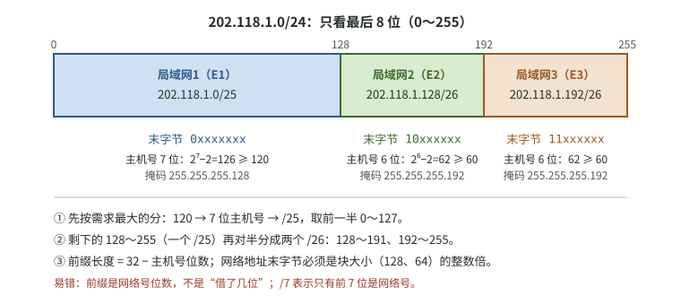
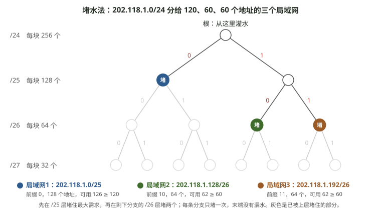
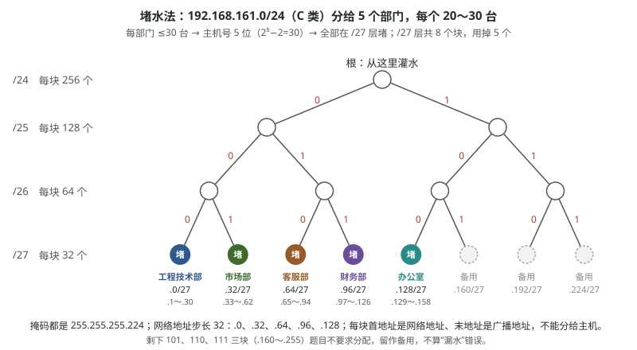

# 2026-10-09 计算机网络｜问答记录

科目：计算机网络。时间为北京时间。

## 08:11　迁移｜一个 /24 分给三个大小不同的局域网（改编自 `408-2009-47`）第 (1) 问图解

**题**：路由器 R1 的 E1、E2、E3 分别连接局域网 1、2、3，需要的地址数分别至少为 120、60、60。现有地址块 202.118.1.0/24，为三个局域网分配子网，写出网络地址和前缀长度。（复习卡第 (1) 问，改编题，不是原真题）

**用户要求**：把复习卡里这道计网迁移题的第一问画出来。

**答复**：画成地址块划分图：末字节 0～127 给局域网 1（202.118.1.0/25，7 位主机号，126 个可用），128～191 给局域网 2（202.118.1.128/26），192～255 给局域网 3（202.118.1.192/26），各 62 个可用。图已挂在 2026-10-08 复盘该卡的参考要点后，翻开答案时显示。

**作答**：本次未作答（只要图）。

来源：2026-10-08 计网复盘自测卡；划分结果为助手计算，与卡上参考要点一致。

## 08:14　同上题第 (1) 问：用“堵水法”画子网划分

**用户要求**：在对话里画图，用堵水法。

**答复**：在对话里画了一张图，把末字节 8 位看成 8 根水管：堵住的管（塞 0 或 1）是网络位，放开的管是主机位，放开 n 根流出 2ⁿ 个地址。局域网 1 堵 1 根（塞 0）放 7 根，得到 /25；局域网 2、3 堵 2 根（塞 10、11）各放 6 根，得到两个 /26。前缀 = 24 + 堵的根数。~~“堵水法”按字面理解为这种画法，未核对是否与某本教材或课程的叫法一致，待用户确认。~~ 更正见 08:17：用户课件里的“堵水法”是二叉树划分法。

来源：助手讲解；划分结果与 2026-10-08 复盘卡参考要点一致。

## 08:17　同上题第 (1) 问：按课件的二叉树“堵水法”重画

**用户提供**：三张湖科大教书匠「408 考研 计算机网络 强化复习 第 4 章 网络层：基于二叉树的子网划分方法」课件截图（举例 1：/24 恰好分 4 块；划分方案不止一种；举例 2：恰好分 5 块只能用变长子网划分）。课件要点：从根节点灌水；在二叉树中挑选满足需求数量的子块作为“堵水点”；每条分支只能有一个堵水点，不能重复封堵；确保末端不漏水。

**答复**：上一条（08:14）的“水管”画法是我对字面的猜测，与课件不同，以本条为准。按二叉树重画：/24 为根，/25 层堵左支 0 → 局域网 1：202.118.1.0/25（128 个，可用 126 ≥ 120）；右支 1 不够分给两个 60，再往下一层，/26 层堵 10、11 → 局域网 2：202.118.1.128/26、局域网 3：202.118.1.192/26（各可用 62 ≥ 60）。三个堵点覆盖全部叶子，没有漏水、没有重复封堵。图已挂到复盘自测卡参考要点后。

**作答**：本次未作答（只要图）。

来源：用户上传课件截图；划分结果与复盘卡参考要点一致。

## 19:08　`王道CN-3.6-综合`（题号待核实）　以太网有效数据传输速率为什么是 1500×8/T

**题**：（据用户上传的王道《2027 计算机网络》第 3 章 3.6.6 答案与解析截图，书页 112～113，题干未截到，按解析整理）甲、乙两站相距 2km，以太网速率 10Mb/s，信号传播速率 200000km/s。甲连续向乙发送最长数据帧 1518B，乙每成功收到一个数据帧就回送一个 64B 的确认帧，甲收到确认帧后才发送下一数据帧。求甲方的有效数据传输速率。

**用户问**：红框里“甲方的有效数据传输速率为 1500×8/T”是怎么算的？

**答复**：
- 有效速率 = 一个发送周期内送出的**有用数据** ÷ 发送周期。
- 发送周期 T = 数据帧发送时延 + 确认帧发送时延 + 往返传播时延 = 1518×8/10⁷ + 64×8/10⁷ + 2×(2km/200000km/s) = 1.2144 + 0.0512 + 0.02 = 1.2856ms。
- 有用数据只算以太网帧的数据部分 1500B。1518B = 目的 MAC 6 + 源 MAC 6 + 类型 2 + 数据 1500 + FCS 4，首部和尾部不算有效数据。所以分子是 1500×8 = 12000bit，而不是 1518×8。
- 12000bit ÷ 1.2856ms ≈ 9334bit/ms = 9.33×10⁶ bit/s = 9.33Mb/s。单位注意 bit/ms 要乘 10³ 才是 bit/s。

**作答**：看解析后追问，未作答。

**变式**（闭卷）：其他条件不变，乙不回确认帧，甲连续发送 1518B 的帧（不考虑帧间隔和冲突），甲的有效数据传输速率是多少？若改为每帧数据部分只有 46B（最短帧 64B）、仍要等 64B 确认帧，有效速率又是多少？

来源：用户上传的王道教材截图；计算为助手核算，与书中结果一致。

## 19:14　`王道CN-4-综合01`（节号待核实）　IP 分片的片偏移为什么这样算

**题**：（据用户上传的王道网络层综合应用题 01 解答截图整理，原题干未截到）一个长度为 4000B（首部 20B）的 IP 数据报，要经过 MTU 为 1500B 的网络传送。应分为几片？写出各片的数据字段长度、片偏移和 MF 值。书中解答：分 3 片，数据字段 1480B、1480B、1020B，片偏移 0、185、370，MF 为 1、1、0。

**用户问**：片偏移字段为什么这样算？

**答复**：
- 片偏移 = 本片数据在**原数据报数据部分**中的起始字节位置 ÷ 8。只数数据部分，不算首部。第 1 片数据是原数据的第 0～1479 字节，偏移 0/8 = 0；第 2 片从第 1480 字节开始，1480/8 = 185；第 3 片从第 2960 字节开始，2960/8 = 370。
- 除以 8 的原因：总长度字段 16 位，片偏移字段只有 13 位，少 3 位，所以单位是 2³ = 8B。由此，除最后一片外，每片的数据长度都必须是 8 的整数倍；1480 恰好是 8 的倍数，所以可以直接用 MTU−20。
- 红框：MF=0 只说明“后面没有分片了”。MF=0 且片偏移=0 是没被分片的独立数据报；MF=0 且片偏移>0 才是分片的最后一片。

**作答**：看解析后追问，未作答。

**变式**（闭卷）：同一个 4000B（首部 20B）的数据报，经过 MTU = 1006B 的网络。应分几片？写出各片数据长度、片偏移和 MF。（提示：先检查 MTU−20 是不是 8 的倍数）

来源：用户上传的王道教材截图；讲解为助手判断，未另核教材页码。

## 19:32　`王道CN-4-综合05`（节号待核实）　分类 IP 地址（A、B、C 类）复习

**题**：（据用户上传的王道网络层综合应用题 05 解答截图整理，原题干未截到）某公司有 5 个部门，每个部门 20～30 台主机，分配到网络地址 192.168.161.0。(1) 应如何组网 (2) 给出各部门的子网掩码、网络地址和主机 IP 地址范围。书中解答：192.168.161.0 是 C 类地址，子网号 3 位、主机号 5 位，掩码 255.255.255.224，五个部门网络地址 .0、.32、.64、.96、.128。

**用户问**：子网分类忘了，什么 A 类、B 类、C 类？

**答复**：分类地址看第一个字节的开头几位：

| 类 | 首字节开头 | 首字节范围 | 默认掩码 | 网络号／主机号 | 用途 |
|---|---|---|---|---|---|
| A | 0 | 1～126（0、127 保留，127 是环回） | 255.0.0.0（/8） | 8／24 | 单播 |
| B | 10 | 128～191 | 255.255.0.0（/16） | 16／16 | 单播 |
| C | 110 | 192～223 | 255.255.255.0（/24） | 24／8 | 单播 |
| D | 1110 | 224～239 | 无 | — | 多播 |
| E | 1111 | 240～255 | 无 | — | 保留 |

私有地址：10.0.0.0/8、172.16.0.0～172.31.255.255（/12）、192.168.0.0/16。本题 192 落在 192～223，所以是 C 类，默认 /24，主机号 8 位；借 3 位做子网号 → /27，掩码 255.255.255.224，2³ = 8 个子网，每个 2⁵ − 2 = 30 个可用地址，满足 20～30。CIDR 出现后考题多不再按类划分，但题目写“C 类地址”时要能立刻换算成默认 /24。

**作答**：看解析后追问，未作答。

**检验**（闭卷）：判断 10.3.5.1、130.20.1.1、200.1.1.1、225.0.0.5 各属于哪一类、默认掩码是什么；把 B 类网络 172.20.0.0 划成至少 50 个子网，子网号至少几位、掩码是多少、每个子网最多几台主机？

来源：用户上传的王道教材截图；分类地址表为助手按通用教材口径整理，未另核王道页码。

## 19:35　`王道CN-4-综合05`（节号待核实）　用堵水法画 5 个部门的子网划分

**题**：见本文件 19:32：192.168.161.0（C 类）分给 5 个部门，每部门 20～30 台主机，求各部门子网掩码、网络地址和主机地址范围。

**用户要求**：用堵水法画。

**答复**：每部门最多 30 台 → 主机号 5 位 → 全部在 /27 层封堵。/27 层共 8 块，堵 000～100 五块给五个部门（.0、.32、.64、.96、.128，掩码 255.255.255.224），101、110、111 三块（.160～.255）留作备用。与 2026-10-08 那题不同：这里各部门大小相同，所有堵点都在同一层。

**作答**：本次未作答（只要图）。

来源：书中解答截图；图为助手绘制。
